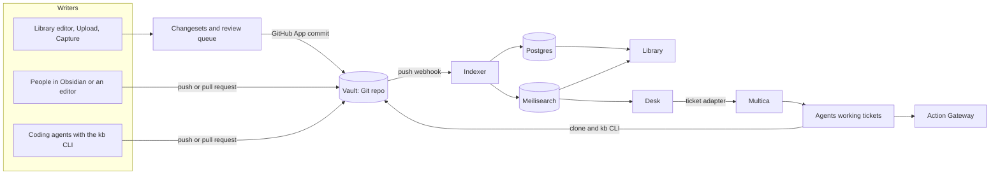
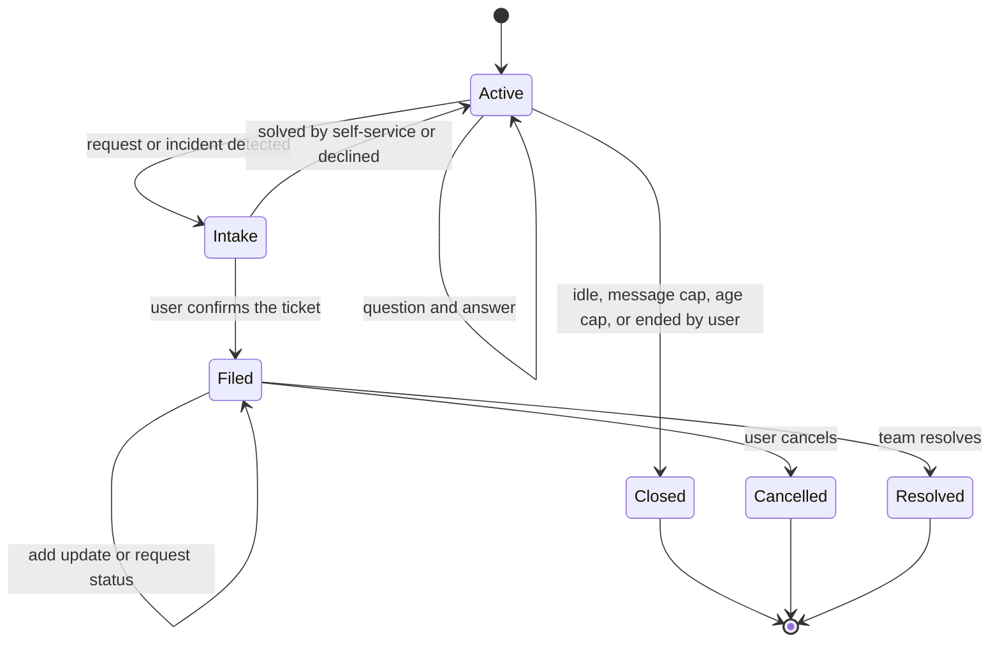

# Lore: Product Requirements Document

Internal knowledge base, documentation hub, and AI helpdesk built on the Open Knowledge Format.

| Item | Value |
|---|---|
| Status | Draft 1.0, ready for build planning |
| Date | 23 September 2026 |
| Working name | Lore (rename freely, nothing depends on it) |
| Companion | TECH_STACK.md (how to build it) |
| Deployments | Two companies, one codebase, one deployment per company |

Section 2 answers every question from the original brief in one line each. The rest of the document is the detail behind those answers. Numbers marked as defaults are starting points to tune with real usage, not commitments.

---

## 1. Summary

Lore is one product with three parts that share a single source of truth.

The Vault is a Git repository of markdown notes that follow Google's Open Knowledge Format (OKF) v0.2. Each note holds one idea, carries YAML frontmatter for type, taxonomy, provenance, and trust, and links to related notes with standard markdown links. The vault is the product. Everything else either writes to it or reads from it.

The Library is the web app for people who will never open a markdown file. It works like Obsidian or Capacities with company features added: sign-in, team-based access, hubs by theme and system, fast hybrid search, an editor that commits to Git, suggested edits, uploads that AI turns into notes, and a review queue.

The Desk is a chat helpdesk. It answers questions from the vault with citations, sends people straight to the right page when a link is enough, walks them through troubleshooting, and when self-service fails it collects the details a team needs and files a ticket in Multica. Once a ticket is filed, the chat turns into a ticket view with deliberate actions only.

A `kb` command-line tool and an agent skill let coding agents navigate the vault from an index instead of searching every folder, and write notes that pass the same rules as everything else.

The design rests on one rule: every writer ends at a Git commit, and every reader reads an index built from Git. Postgres and Meilisearch are caches that can be rebuilt. AI drafts, links, classifies, and answers, but nothing depends on it. If every model provider is down, people still browse and search the Library, the Desk falls back to search results and plain request forms, and every action note carries a manual procedure a person can follow. If Lore itself is down, the vault is still a folder of readable markdown with index files that works in GitHub, Obsidian, or a text editor.

---

## 2. Decisions at a glance

| Question from the brief | Decision | Section |
|---|---|---|
| How do we store knowledge? | An OKF v0.2 bundle in a Git repo (the `kb/` folder), one atomic note per file. Lore adds its own fields as extra frontmatter keys, which OKF explicitly allows. | 6 |
| How does a UI upload become markdown in GitHub? | The file goes to object storage, a background job extracts it, an AI step splits it into atomic notes, a linter validates them, and the result becomes a changeset. When published, a GitHub App commits the changeset as one commit. A push webhook triggers re-indexing. | 7.2 |
| Is that the right process? | Yes. Every writer (editor, upload, coding agent, person in Obsidian) ends at a commit, and every reader uses an index built from the commit history. There is never a second source of truth to reconcile. | 7.2 |
| How do we manage namespaces, themes, and tags? | Five dimensions with clear jobs: namespace (ownership and access), type, theme (1 to 3 curated hubs), system (curated hubs per tool), tags (governed topics with aliases). AI receives the full vocabulary and must reuse it. New terms go to a taxonomy queue. | 6.4 |
| How do we prevent duplicates? | At write time, AI and people see similar notes before creating one, and the pipeline checks similarity again after drafting. A scheduled Gardener job scans a namespace or the whole vault and proposes merges. | 7.4 |
| Edit or suggest edits per page? | Both. Writers get Edit, which commits directly. Everyone else gets Suggest edit, which goes to the namespace review queue. | 7.5 |
| What happens when a process changes? | The note is updated in place and marked as a Process change. That writes a log entry, notifies owners and followers, shows a Changed badge for 30 days, flags linking notes for review, and makes the Desk mention the change date. A replaced process is deprecated and points to its successor. | 7.6 |
| Semver for documents? | Git history is the full record. Each note also carries a simple `version` bumped by change class: Fix is a patch, Addition is a minor, Process change is a major. | 6.6 |
| Downvotes? | Helpful and Report issue, with a reason (outdated, incorrect, unclear, missing information, duplicate). Reports lower a note's health score, show a banner, notify owners, and make the Desk warn or rank the note lower. | 7.7 |
| How complicated is the writing workflow? | Not at all. Write permission on a namespace means you can publish there. Review applies only to people without write access, AI output in namespaces set to manual, new taxonomy terms, duplicates, destructive changes, and action or request definitions. | 7.3 |
| Auto or manual AI processing? | AI processing runs in batches (every 2 hours by default) with a Process now button. Publishing is set per namespace: auto (AI output publishes unless a review rule fires) or manual (everything AI drafts is reviewed). New namespaces start manual. | 7.2 |
| How does the helpdesk retrieve knowledge? | Hybrid keyword plus vector search in Meilisearch over heading-aware chunks with contextual headers, grouped by note, expanded along links, optionally reranked, with citations checked in code. No separate vector database. | 10.4 |
| Non-LLM intent detection? | A cascade: rules first, then an embedding classifier trained from examples, then a small LLM only for uncertain messages. | 10.3 |
| How do we stop it becoming a free Claude? | Topic lock, off-topic replies without calling a model, per-user and per-session quotas, idle close, short answers that link to pages, and a monthly budget that falls back to search-only. | 10.6 |
| Multica or build our own ticketing? | Use Multica behind an adapter. Do not build a ticket system. Lore keeps a small ticket mirror for My tickets and follow-up rules, so switching tools later means writing one adapter. | 11.1 |
| Action packs? | `type: Action` notes in the vault with `execution` set to auto, approval, or manual, typed parameters, an executor, and a required manual procedure. An Action Gateway enforces the policy in code, never the prompt. | 11.3 |
| Can we combine models to save cost? | Yes. Route by task: no model for navigation and status, embeddings for intent, a small model for rewrites, slot filling, and single-note answers, a mid model for synthesis and ingestion. Batch APIs for ingestion, prompt caching everywhere. Roughly $40 to $50 a month in LLM spend per company at the assumed volume. | 12 |
| Login, RBAC, teams? | Better Auth with the organization and teams plugins. Teams are departments. Namespace grants (read, write, maintain) go to teams or individuals and are enforced on the server for every read path. | 9 |
| Hosting now? | Per company: one Lightsail instance running Docker Compose, Lightsail managed Postgres, and a Lightsail bucket. About $85 a month before Multica and LLM usage. | TECH_STACK 15 |
| Supabase and Convex later? | Supabase works by configuration (it is Postgres plus S3-compatible storage). Convex is not a target because it would mean rewriting the data layer; revisit only if a customer requires it. | TECH_STACK 16 |
| Which LLMs? | Bring your own key for Anthropic, OpenAI, Google Gemini, and OpenRouter, with a primary and fallback model per task. | 12 |
| Two companies, minimal customization? | Single-tenant deployments from the same images. Differences live in configuration and in each company's vault profile, never in code branches. | 13 |

---

## 3. Goals, non-goals, and principles

### Goals

1. One trusted place that explains how the company works: processes, systems, how-tos, runbooks, and policies, readable by people and by agents.
2. Anyone can contribute in the way that suits them: a text editor, a coding agent, the web editor, an upload, or a rough dump that AI tidies up.
3. Staff get an answer or reach the right team within one conversation, and teams receive tickets that already contain what they need.
4. Knowledge survives outages, tool changes, and vendor changes because it is plain markdown in Git in an open format.
5. Two companies run the same product through configuration rather than forks.

### Non-goals for v1

The Desk is not a general-purpose assistant; it answers from the vault and files tickets. Lore is not a ticketing system; Multica owns assignment, workflow, and board views. There is no real-time co-editing of the same note. Lore is internal only, with no public help center. There are no multi-step approval chains for content, no model fine-tuning, and no LLM-extracted knowledge graph, because the links people write are the graph.

### Principles

1. Git is the source of truth. Databases and search indexes are caches that can be rebuilt from it.
2. Everything works without AI. AI makes things faster and never becomes the only path.
3. One pipeline for all writers. People, the UI, and agents produce the same changesets, pass the same linter, and land as commits.
4. Cheap before smart. Rules, then search, then small models, then larger models.
5. Trust is visible. Every note shows who wrote it, who verified it, and when it needs review.
6. Guardrails live in code, not prompts. Permissions, quotas, and action policies are enforced outside the model.
7. Start simple and tighten with data. Defaults in this document are starting points.

---

## 4. Users and roles

| Persona | What they need | Main surface |
|---|---|---|
| Staff member | Find answers quickly, file requests and incidents, see ticket status | Desk, Library |
| Contributor (non-technical writer) | Write and update notes for their team, upload existing documents, turn rough notes into proper ones | Library editor, Upload, Capture |
| Engineer (technical writer) | Document systems and code with a coding agent, edit markdown directly | Vault repo, `kb` CLI, agent skill |
| Namespace maintainer (team lead or owner) | Review submissions, manage taxonomy for their area, keep their notes healthy | Review, Hygiene, Taxonomy |
| Service team member | Triage and resolve tickets using runbooks | Multica, Library |
| Admin | Users, teams, grants, AI keys, budgets, integrations, branding | Admin |
| AI agents (service identities) | Read the vault, propose changes, run permitted actions | `kb` CLI, MCP server, Action Gateway |

Section 9 covers permissions in full. The short version: organization roles (owner, admin, member) decide who administers Lore; namespace grants (read, write, maintain) decide who reads and writes which knowledge; teams are departments and receive grants.

---

## 5. Architecture overview



Writers change the vault in one of two ways. People and coding agents with repository access push commits or open pull requests. Everyone else works in the Library, where each change becomes a changeset that the Lore GitHub App commits. Either way, a push webhook tells the indexer to parse the changed files, update the note cache in Postgres, and update the search indexes in Meilisearch. The Library and the Desk read only from those indexes, filtered by the user's permissions.

| Component | What it is | Source of truth for |
|---|---|---|
| Vault | Git repository with the OKF bundle in `kb/` | All knowledge, taxonomy, request types, action definitions |
| Library | Web app for browsing, search, editing, review, admin | Nothing (reads indexes, writes changesets) |
| Desk | Chat helpdesk inside the same web app | Nothing (reads indexes, files tickets) |
| Worker | Background jobs: indexing, ingestion, commits, Gardener, ticket sync | Nothing |
| Postgres | App data plus a cache of parsed notes | Users, grants, changesets, feedback, chat sessions, ticket mirror, usage |
| Meilisearch | Keyword and vector search | Nothing (rebuilt from the vault) |
| Multica | Ticket board and agent execution | Tickets and their workflow |
| Action Gateway (phase 3) | Policy enforcement for actions agents may run | Action run history (receipts, approvals) |

---

## 6. Knowledge model

### 6.1 Vault layout

Each company has one vault repository. The OKF bundle lives in `kb/`, so repository files such as the README and agent instructions do not need OKF frontmatter.

```text
acme-vault/
  README.md                     how the vault works, how to contribute
  AGENTS.md                     instructions for coding agents
  CLAUDE.md                     one line: @AGENTS.md
  .agents/skills/kb-writer/     skill that teaches agents to write notes
  .kb/
    profile.yaml                types, required fields, limits, custom fields, stale defaults
    namespaces.yaml             namespace registry: title, description, owner team
    tags.yaml                   governed tags and their aliases
    eval/questions.yaml         golden questions for retrieval testing
  .github/workflows/kb.yml      lint on every change, regenerate indexes on main
  kb/                           the OKF bundle
    index.md                    generated; declares okf_version "0.2"
    log.md                      vault-level history (new namespaces, taxonomy merges)
    _meta/
      graph.json                generated link graph
      graph-report.md           generated map: hubs, clusters, orphans, gaps
    _themes/
      enrollment.md             Theme hub
    _systems/
      salesforce.md             System hub
    admissions/                 a namespace
      index.md                  generated listing
      log.md                    history of process changes in this namespace
      _assets/                  images used by notes in this namespace
      references/               extracted source documents (provenance)
      enroll-a-returning-student-in-salesforce.md
      actions/
        resend-enrollment-confirmation.md
      request-types/
        report-an-enrollment-problem.md
    it-support/
      ...
```

Top-level folders under `kb/` are namespaces. Deeper folders are for tidiness only and carry no meaning. Folders that start with an underscore are managed by Lore. File names are kebab-case titles and may change; each note's `id` never changes, so links and URLs survive renames.

### 6.2 Note format

A note is an OKF concept: YAML frontmatter plus a markdown body. OKF requires only `type` and recommends `title`, `description`, `resource`, and `tags`; v0.2 adds optional provenance (`sources`), trust (`generated`, `verified`), and lifecycle (`status`, `stale_after`) fields, and requires consumers to preserve keys they do not recognise. Lore uses all of those and adds a few flat keys of its own.

| Field | From | Required in Lore | Purpose |
|---|---|---|---|
| `type` | OKF | Yes | One of the types in 6.3 |
| `title` | OKF | Yes | Specific, unique within the namespace |
| `description` | OKF | Yes | One sentence. Used in index files, search results, and Desk cards |
| `tags` | OKF | No | 0 to 8 governed topic tags |
| `resource` | OKF | No | Canonical URI of the thing described (a system page, a repo path) |
| `sources` | OKF | For AI-drafted notes | Where the content came from: an uploaded document, a code path at a commit, a web page |
| `generated` | OKF | Set by tooling | `{ by, at }`: who made the last meaningful change and when |
| `verified` | OKF | No | List of `{ by, at }` confirmations. Drives the trust tier |
| `status` | OKF | No | `draft`, `stable` (default), or `deprecated` |
| `stale_after` | OKF | No | Instant after which the note needs review. Set when verified |
| `id` | Lore | Yes | `kb_` plus a ULID. Never changes. Used in URLs and to survive renames |
| `version` | Lore | Yes | Semver-lite, see 6.6 |
| `themes` | Lore | Yes | 1 to 3 theme slugs |
| `systems` | Lore | No | System slugs |
| `owner` | Lore | No | Team slug. Defaults to the namespace owner |
| `aliases` | Lore | No | Other names people search for |
| `superseded_by` | Lore | When deprecated | Path of the replacement note |

The namespace is not a frontmatter field. It is the top-level folder, which avoids two places that could disagree. Companies can add custom fields in `.kb/profile.yaml` (for example `audience` or `region`); the linter validates them and the Library shows them as filters.

Example of a How-To note:

```markdown
---
type: How-To
title: Enroll a returning student in Salesforce
description: Reactivate a former student's record and open a new enrollment without creating a duplicate contact.
id: kb_01J9Z6Q4X8M2T7C3VQ5R1N0B8D
version: 1.2.0
themes: [enrollment]
systems: [salesforce, sis]
tags: [returning-students, duplicates]
owner: admissions-ops
aliases: [re-enroll a student, reactivate a student]
resource: https://acme.lightning.force.com/lightning/o/Enrollment__c/home
status: stable
generated: { by: human:mreyes, at: 2026-09-02T08:15:00Z }
verified:
  - { by: human:mreyes, at: 2026-09-02T08:15:00Z }
stale_after: 2027-03-02T00:00:00Z
sources:
  - id: sis-sop
    resource: /admissions/references/sis-enrollment-sop-2025.md
    title: SIS enrollment SOP (2025)
---

# When to use this

Use this when a student who left or graduated applies again. For first-time
students, follow [Enroll a new student](/admissions/enroll-a-new-student.md).

# Steps

1. Search Salesforce by student ID, not by name. Returning students keep their ID.[^sis-sop]
2. Open the existing contact and set the status to Returning.
3. Create the enrollment from the contact, never from the Enrollments tab.

# Related

- [Enrollment lifecycle](/_themes/enrollment.md)
- [Clean up duplicate contacts](/admissions/clean-up-duplicate-contacts.md)

[^sis-sop]: SIS enrollment SOP (2025)
```

Per-claim attribution uses markdown footnotes keyed to `sources` entries, which is the OKF v0.2 convention.

### 6.3 Note types

OKF does not register types centrally, so each company can extend this list in its profile. These are the defaults.

| Type | Use it for | Desk behaviour | Default review interval |
|---|---|---|---|
| Explanation | What something is and why it works that way | Used in answers | 12 months |
| How-To | Steps for one task with one goal | Used in answers | 6 months |
| Process | A multi-step business process across roles or systems: who does what, when | Used in answers | 6 months |
| Runbook | Operational or incident procedures for a service team | Shown only to people with write access to the namespace; linked on tickets | 6 months |
| Reference | Lookup facts: fields, codes, contacts, limits, SLAs | Used in answers | 12 months |
| Policy | Rules people must follow | Used in answers, always cited | 12 months |
| Decision | A recorded decision and its reasons | Used for "why" questions | None |
| Theme | Hub page for a theme | Used for navigation | None |
| System | Hub page for a system or tool | Used for navigation | 12 months |
| Request Type | Something people can request or report; drives Desk intake | Drives intake forms | 12 months |
| Action | An operation an agent or person can perform (action packs) | Never shown to requesters | 6 months |
| Source Document | Extracted text of an uploaded file, kept for provenance | Not used in answers | None |
| Graph Report | Generated map of the vault for agents | Not used in answers | Generated |

Runbook visibility on the Desk is about relevance, not secrecy. Anything that must be secret belongs in a restricted namespace or a separate vault (section 9).

### 6.4 Taxonomy

Five dimensions, each with one job:

| Dimension | Per note | Answers | Lives in | Managed by | Examples |
|---|---|---|---|---|---|
| Namespace | Exactly 1 | Who owns it and who can see it | Top-level folder plus `.kb/namespaces.yaml` | Admins | admissions, finance, it-support |
| Type | Exactly 1 | What kind of document is it | `type` | Profile (admins) | How-To, Runbook |
| Theme | 1 to 3 | Which business journey or area is it part of | `themes` plus a hub in `_themes/` | Maintainers | enrollment, onboarding, month-end-close |
| System | 0 or more | Which tool is it about | `systems` plus a hub in `_systems/` | Maintainers | salesforce, sis, netsuite |
| Tag | 0 to 8 | Which finer topics does it touch | `tags` plus `.kb/tags.yaml` | Writers propose, maintainers approve | returning-students, refunds |

Themes and systems cut across namespaces, which is what makes the enrollment example work. Admissions writes "Enroll a returning student in Salesforce" (namespace admissions, theme enrollment, systems salesforce and sis). Finance writes "Post an enrollment deposit" (namespace finance, theme enrollment, system netsuite). IT writes "How the SIS to Salesforce sync works" (namespace it-support, type Explanation, theme enrollment, systems sis and salesforce). The Enrollment hub shows all three grouped by type, the Salesforce hub shows the first and third, and each namespace page shows only its own notes. Nobody had to agree on a single folder.

Governance rules:

1. AI never invents a term silently. Every AI job receives the full vocabulary (namespaces, themes, systems, tags, aliases, and their descriptions) and must choose from it. If nothing fits, it may propose a new term with a one-line reason. The proposal goes to the taxonomy queue, and the changeset waits until a maintainer accepts the term, maps it to an existing term as an alias, or rejects it.
2. Aliases absorb synonyms. `tags.yaml` maps variants to a canonical tag (for example `re-enrollment` to `returning-students`). The linter rewrites aliases to canonical terms automatically.
3. Renames and merges are one operation. Renaming or merging a term in the Taxonomy screen or with `kb taxonomy` rewrites every affected note in a single commit.
4. Drift is visible. The Gardener reports near-duplicate terms, tags used once, themes that behave like tags, and hubs with no description.

Theme and System hubs are ordinary notes with a human-written introduction and a generated member list between `<!-- kb:members:start -->` and `<!-- kb:members:end -->` markers. Because the list is written into the file, hubs work in Obsidian and GitHub as well as in the Library.

### 6.5 Atomic notes and links

Atomic rules, enforced by the linter where possible:

1. One note, one idea: one task, one process, one concept, one decision.
2. A specific title that could answer a search. "Enroll a returning student in Salesforce", not "Salesforce notes".
3. A one-sentence description.
4. Target length of 150 to 1,200 words. The linter warns above 1,200 words and fails above 2,500 words, which means the note should be split.
5. At least one link to a hub, and links to related notes. Notes with no links in either direction are reported as orphans.
6. Link instead of copying. If a step is documented elsewhere, link to it.

Links are standard markdown links with bundle-absolute paths such as `/admissions/enroll-a-new-student.md`, which OKF recommends because they survive moves within a folder. The Library editor offers `[[` autocomplete but writes standard links. Obsidian-style wikilinks pasted into a note are converted by `kb lint --fix`. OKF treats a link to a missing note as knowledge not yet written rather than an error, so Lore lists broken links as "wanted notes" in the Hygiene view instead of blocking commits. Moving or renaming a note through the Library or `kb mv` rewrites every inbound link in the same commit.

For Obsidian users, the vault to open is the `kb/` folder so that leading-slash links resolve from the right root. This needs a short compatibility check (TECH_STACK section 20); the fallback is relative links, which OKF also allows.

### 6.6 Lifecycle, trust, and versioning

Lifecycle follows OKF `status`. Draft notes are visible with a Draft badge to people who can write in the namespace and are never used by the Desk. Stable is the default. Deprecated notes stay for history and inbound links, show a banner pointing to `superseded_by`, drop out of default search results, and are never cited by the Desk.

Trust follows the OKF tiers, derived from `verified`: unverified (no entries), machine-confirmed (only automated verifiers), and human-reviewed (at least one `human:` verifier). The Library shows the tier as a badge. The Desk ranks human-reviewed notes higher and tells the user when an answer relies on an unverified note.

A person verifies a note by ticking "I checked this is accurate" when saving, by clicking Mark verified on the note page, or by approving a changeset in review. Verification appends `{ by: human:<id>, at: <now> }` to `verified` and sets `stale_after` to now plus the type's review interval. Once `stale_after` passes, the note is stale: the owner sees it in the weekly digest, the Library shows a Review due badge, and the Desk ranks it lower and says it may be out of date.

`generated` records the actor of the latest Addition or Process change: `human:<id>` for people, `<job>/<model>` for AI (for example `lore-ingest/claude-sonnet-5`), and `process:<name>` for automated jobs, following the OKF actor convention. A Process change resets `verified` to the entries added with that change, because earlier confirmations were about different content. Git keeps the history.

Versioning: Git is the complete record of every change. The `version` field is a readable summary of how much a note has changed, bumped from the change class the writer (or the AI, subject to review) selects:

| Change class | Example | Bump | Side effects |
|---|---|---|---|
| Fix | Typo, broken link, formatting, a clarification that does not change meaning | Patch: 1.2.0 to 1.2.1 | None |
| Addition | New section, extra context, a new optional step | Minor: 1.2.1 to 1.3.0 | Followers see it in their digest |
| Process change | Steps, owners, rules, or systems changed; the old instructions are now wrong | Major: 1.3.0 to 2.0.0 | Log entry, owner team and followers notified immediately, Changed badge for 30 days, linking notes flagged, Desk mentions the change date for 30 days |

New notes start at 1.0.0, or 0.1.0 while in draft. Full semver for the whole vault is unnecessary because the vault is published continuously. For audits, an admin can tag a snapshot of the repository (for example `vault-2026-09`) from the Admin screen.

### 6.7 Where agents start

Coding agents should never have to grep the whole vault. `kb index` runs in CI on every push to main and generates three entry points, inspired by how graphify gives agents a map before they search:

1. `index.md` files in every folder, following the OKF index format: grouped listings of titles and descriptions for progressive disclosure. The root index lists namespaces, themes, and systems with their descriptions and note counts.
2. `_meta/graph.json`: every note with its id, path, type, namespace, themes, systems, tags, trust tier, and status, plus every link and hub membership as an edge.
3. `_meta/graph-report.md`: a short readable map with the most linked notes, clusters of related notes, notes per theme and system, orphans, wanted notes, and counts of stale and unverified notes.

`AGENTS.md` tells agents to read the root index and the graph report first, to use `kb query` and `kb related` before grepping, and to follow the kb-writer skill when writing. `kb query` builds a local search index from the files, so it works offline with no server and no AI.

---

## 7. Authoring

### 7.1 Six ways to add knowledge

| Path | Who | How it works | Result | Category in the brief |
|---|---|---|---|---|
| Direct edit | Anyone with repository access | Edit markdown in Obsidian or any editor, run `kb lint --fix`, push or open a pull request | Commit or pull request, linted in CI | Human, manual |
| Coding agent | Engineers | Ask the agent to document a service or derive a process from code. The kb-writer skill makes it search existing notes first, reuse the taxonomy, write atomic notes whose `sources` point at repo paths and commit SHAs, and run the linter before committing | Commit or pull request | AI prompted by a human |
| Library editor | Writers | Edit in the browser with live preview and a frontmatter form, choose a change class, save | Direct commit | Human, manual |
| Suggest edit | Any reader | The same editor, plus a short required reason | Changeset in review | Human, manual |
| Upload | Any member | Upload a file and optionally set namespace, theme, and tags. There is no prompt box | Changeset, published or reviewed | AI processing |
| Capture | Any member | Paste rough text and screenshots, optionally naming the note this updates | Changeset, published or reviewed | Human draft, AI enhancement |

Upload has no prompt box on purpose. It is document processing with a fixed pipeline, which keeps the output predictable and keeps Upload from turning into a chat window. Capture is where people dump rough material; the only extra input is an optional pointer to the note being updated.

Anyone can upload or capture into a namespace they can read, which keeps contributing easy. Submissions from people without write access always go to review.

Each namespace has an "AI processing allowed" flag. When it is off (for legal or HR material, or when no AI provider is configured), uploads are converted to markdown without any model and saved as a draft for a person to finish.

### 7.2 From upload to commit

| Stage | What happens | Model use |
|---|---|---|
| 1. Intake | The file is stored in the bucket and an item is created with the submitter, hints, and target namespace. A file identical to an earlier upload is flagged | None |
| 2. Extract | Word, PowerPoint, Excel, CSV, HTML, and markdown are converted by deterministic code. PDFs and images are read by a multimodal model, or by Docling where enabled | PDFs and images only |
| 3. Gather context | Similar notes are found with hybrid search. The vocabulary and the profile rules are loaded | Embeddings |
| 4. Atomize | The model plans the notes: create, update an existing note, or skip because it is already covered. It picks type, namespace, themes, systems, and tags from the vocabulary, writes each note with links and `sources`, and proposes a change class for updates | Mid-size model |
| 5. Validate | Schema, vocabulary, links, size, secret scan, and a second duplicate check. Failures get one automatic repair attempt | Rarely |
| 6. Changeset | File operations with a rendered diff, a short summary of what the AI did and why, warnings, and a link to the source | None |
| 7. Gate | Publish if the rules in 7.3 allow it, otherwise send to the review queue | None |
| 8. Commit | The GitHub App commits the changeset as one commit that credits the submitter | None |
| 9. Index | The push webhook triggers re-indexing, and the submitter gets links to the new or updated notes | Embeddings |

The extracted text of the source document is saved as a Source Document note in the namespace's `references/` folder, following the OKF references convention, while the original file stays in the bucket. Provenance therefore travels with the vault even without Lore, and binaries stay out of Git. Images that notes use go into the namespace's `_assets/` folder.

Two separate settings control automation:

- Processing schedule (per deployment): batched every 2 hours during working hours through provider batch APIs, which cost about half as much as normal calls, or manual, where maintainers run the queue themselves. Writers can press Process now on an item, which uses the normal API.
- Publishing mode (per namespace): auto, where AI output publishes unless a review rule in 7.3 fires, or manual, where every AI changeset is reviewed. New namespaces start in manual mode and move to auto once reviews show the output is reliable.

Is this the right process? Yes. Three alternatives were considered and rejected. Keeping notes in the database and exporting markdown creates two sources of truth and loses Git history and the agent workflow. Letting the web server keep a working copy and push from it works, but adds locking and credential problems; the GitHub API can create a multi-file commit atomically against an expected head, with no working copy on the web server. Opening a pull request for every change is too heavy for a lean team, although it remains available as a per-vault option.

### 7.3 When review is required

Writers publish directly. A changeset goes to review only when at least one of these is true:

1. The submitter cannot write to the target namespace (suggestions, and uploads or captures from readers).
2. AI drafted it and the namespace is in manual mode.
3. AI proposes a Process change, or changes a note that a person has verified.
4. It introduces a new namespace, theme, system, or tag.
5. It is flagged as a likely duplicate of an existing note or as contradicting one.
6. It deletes, merges, or deprecates notes, or moves them between namespaces.
7. It creates or changes an Action or Request Type note, because those change what agents and the Desk do.
8. Validation found problems that the automatic repair could not fix.

Writers in the namespace approve content changesets. Maintainers approve taxonomy proposals, destructive changes, and Action or Request Type changes. Approving counts as a human verification by the reviewer.

The review screen shows the rendered and raw diff, the AI summary and warnings, and similar notes side by side. Reviewers can edit before approving, approve, request changes (which returns the item to the submitter with a comment), or reject with a reason. Items waiting more than 5 working days appear in the owner's digest.

Every changeset records the blob SHA of each file it touches. If a file changed in Git after the draft was made, the item is marked conflicted, and the reviewer can re-run the AI merge or resolve it by hand.

### 7.4 Preventing duplicates

1. Before writing. Agents and the atomizer must search first (`kb related`, similar notes) and prefer updating an existing note over creating one. In the Library editor a Similar notes list appears as soon as a title is typed, using search only.
2. After drafting. Validation compares each new note with the vault using note-level embeddings plus title and alias matching. Starting thresholds: a cosine similarity of 0.92 or more is a likely duplicate, which blocks auto-publishing and asks the reviewer to merge, keep both with links, or discard. Between 0.85 and 0.92 the notes are related, so the pipeline adds links and shows a warning. Thresholds depend on the embedding model and are tuned on real data.
3. Routine cleanup. The Gardener runs weekly and on demand for one namespace or the whole vault. It finds duplicate clusters, orphans, wanted notes, stale and unverified notes, heavily reported notes, taxonomy drift, and Desk knowledge gaps (clusters of questions that found nothing). Its output is proposals in the review queue and a Hygiene dashboard. It never applies structural changes by itself.

### 7.5 Edits and suggestions

Every note page shows Edit to writers and Suggest edit to everyone else. Both open the same editor. Edit commits with the chosen change class, with Fix preselected for small diffs. Suggest edit asks for a short reason and lands in review. The editor remembers the blob SHA it loaded, so if someone else changed the note in the meantime the user sees a merge view instead of silently overwriting. There is no real-time co-editing.

### 7.6 When a process changes

Edit the note in place and mark the change as a Process change; the effects listed in 6.6 follow automatically. Notes, Request Types, and Actions that link to the changed note are flagged in their owners' digest with the date of the change, since they may need updating too.

When a process is replaced by a different one (a new system or a different owner team), create a new note and set the old one to `deprecated` with `superseded_by`. The old note stays for history, inbound links are flagged, and the Desk stops citing it.

A change that takes effect on a future date is kept as a draft note and published on the day. Scheduled publishing can come later if people ask for it.

People editing in Git get the same behaviour: the indexer treats a major version bump as a Process change, and `kb bump --class process` sets the version and writes the log entry.

### 7.7 Feedback on notes

Each note has Helpful and Report an issue. A report needs a reason (outdated, incorrect, unclear, missing information, duplicate, or other) and can include a comment. Reports carry the reporter's name, are visible to the namespace's writers, and are limited to 10 per person per day. Ratings on Desk answers also count toward the notes those answers cited.

An open report of incorrect or outdated content shows a banner ("Reported as outdated on 14 Sep, owner notified"), makes the Desk warn about and rank down the note, and appears in the owner's Review list and digest. A report closes when a commit resolves it or an owner dismisses it with a reason. Each note's health score combines open reports, staleness, trust tier, helpful rate, and broken links, and the Hygiene view sorts by it.

### 7.8 Authoring requirements

| ID | Requirement | Phase |
|---|---|---|
| AU-1 | Every write made in Lore becomes one Git commit through the GitHub App, crediting the person with a Co-authored-by trailer | 1 |
| AU-2 | Library editor: markdown with live preview, frontmatter form, `[[` autocomplete that inserts standard links, image paste into `_assets/`, change class selector, verified checkbox, similar notes panel | 1 |
| AU-3 | Suggest edit for every reader, with a required reason | 1 |
| AU-4 | Upload accepts PDF, DOCX, PPTX, XLSX, CSV, HTML, MD, TXT, PNG, and JPG up to 25 MB and 60 pages, with optional namespace, theme, and tags and no prompt box | 1 |
| AU-5 | Capture accepts text and up to 10 images, with an optional link to the note being updated | 1 |
| AU-6 | Processing schedule (batched or manual) and Process now | 1 for Process now, 2 for batching |
| AU-7 | Publishing mode per namespace, defaulting to manual | 2 (phase 1 reviews everything AI drafts) |
| AU-8 | Review rules from 7.3 enforced on the server | 1 |
| AU-9 | One set of validation rules shared by `kb lint`, CI, and the pipeline | 0 |
| AU-10 | Taxonomy queue with accept, map to alias, and reject; renames and merges land as one commit | 2 |
| AU-11 | Gardener, weekly and on demand per namespace or vault, producing proposals only | 2 |
| AU-12 | Per-namespace "AI processing allowed" flag; when off, uploads become drafts without any model call | 1 |
| AU-13 | Conflict detection by blob SHA, with a merge view | 1 |
| AU-14 | Change classes drive version, log entries, notifications, and badges for Lore edits and Git pushes alike | 1 |
| AU-15 | Feedback with reasons, banners, and a health score | 1 |
| AU-16 | Source documents kept as Source Document notes, originals kept in the bucket | 1 |

---

## 8. Library

The Library should feel like a note app, not a wiki admin panel. A left sidebar holds Home, Search, Namespaces, Themes, Systems, Types, Tags, Graph, Desk, and My tickets, plus Review and Hygiene for writers and Admin for admins.

Home shows a search box, processes that changed in the last 30 days, recent updates in the reader's namespaces, followed notes, and hubs pinned by their team.

Search is available everywhere through a Cmd-K palette and on a full results page. It uses hybrid search with typo tolerance, facets for namespace, type, theme, system, tag, trust tier, and status, highlighted snippets, and results that show title, description, namespace, and trust badge.

Collections give Capacities-style views of every note of one type (all Policies, all Runbooks) as a table or as cards, with filters and sorting by last update or health.

A note page has a header (title, type, namespace, theme and system chips, trust badge, version, last change and who made it, owner), banners (draft, deprecated, stale, reported, recently changed), the body, and a side panel with backlinks, outgoing links, a small local graph, related notes, sources, and history (commits with their change class and a diff view). Its actions are Edit or Suggest edit, Mark verified, Follow, Helpful, Report an issue, Copy link, and Open in GitHub. URLs take the form `/n/<id>/<slug>`, so they survive renames and moves.

Hub pages show the introduction, members grouped by type, a small graph, and owners. The graph view shows the whole vault, colored by namespace or theme, with filters and cluster labels; clicking a node opens the note.

Notifications arrive in the app and by email: review requests, reports on your notes, process changes in notes you follow, and a weekly owner digest of stale, reported, and unverified notes, pending reviews, and knowledge gaps.

| ID | Requirement | Phase |
|---|---|---|
| LB-1 | Browse by namespace, theme, system, type, and tag; hub pages with generated member lists | 1 |
| LB-2 | Cmd-K and full search with facets; results filtered by permission on the server | 1 |
| LB-3 | Note page with metadata header, banners, backlinks, outgoing links, related notes, sources, and history with diffs | 1 |
| LB-4 | Stable URLs based on note id | 1 |
| LB-5 | Local graph on the note page | 1 |
| LB-6 | Every browse, search, and edit feature works with no AI provider configured; search falls back to keyword only | 1 |
| LB-7 | WCAG 2.2 AA; responsive layout for reading on phones | 1 |
| LB-8 | Branding per deployment: name, logo, colors, Desk greeting | 1 |
| LB-9 | Follow notes and hubs; notifications and weekly digest | 2 |
| LB-10 | Global graph view | 2 |
| LB-11 | Hygiene dashboard | 2 |

---

## 9. Access control

Organization roles come from Better Auth: owner, admin, and member. Owners and admins manage users, teams, grants, and settings. Teams represent departments, and a person can belong to several. Namespace grants give read, write, or maintain to a team or to a person; write includes read and maintain includes write. A namespace's visibility is either company, where every member can read it and grants only add write or maintain, or restricted, where only granted teams and people can read it.

| Capability | Member | Read grant | Write grant | Maintain grant | Admin |
|---|---|---|---|---|---|
| Read company namespaces | Yes | Yes | Yes | Yes | Yes |
| Read restricted namespaces | No | Yes | Yes | Yes | Yes |
| Use the Desk and file requests | Yes | Yes | Yes | Yes | Yes |
| Suggest edits, upload, capture (always reviewed) | In readable namespaces | Yes | Yes | Yes | Yes |
| Edit and publish, approve content changesets, mark verified | No | No | Yes | Yes | Yes |
| See Runbooks and Actions in Desk answers | No | No | Yes | Yes | Yes |
| Approve taxonomy terms, deletes, merges, moves, Action and Request Type changes | No | No | No | Yes | Yes |
| Change namespace settings (publishing mode, AI processing flag) | No | No | No | Yes | Yes |
| Manage users, teams, grants, AI settings, integrations | No | No | No | No | Yes |

Every read path filters by the namespaces the user can read, on the server: pages, search, Desk retrieval, related notes, the graph, exports, and the MCP server. Meilisearch is never exposed to the browser.

Git cannot hide folders inside one repository. Anyone with access to the vault repository can read every namespace in it, and anyone with write access can change any namespace without going through Lore's grants. Three consequences follow. Give repository write access only to people trusted across the whole vault, and use CODEOWNERS with branch protection if some folders need an owner's review. Treat restricted namespaces inside the main vault as hidden in Lore but not in GitHub. Put genuinely confidential knowledge (HR cases, legal matters, security details) into a separate vault repository with its own GitHub access. The data model supports several vaults per deployment from the start; the interface for a second vault ships in phase 3, or earlier if a company needs it.

People sign in with Google Workspace or Microsoft Entra ID, restricted to the company's email domains, with an email magic link as a fallback for small setups. New people are created on first sign-in as members. In v1, team membership is managed in Lore; syncing groups from the identity provider can come later.

Multica, CI, MCP clients, and the Gardener use service accounts with scoped tokens, and their changes are attributed using the OKF actor convention. An audit log records sign-ins, grant changes, commits made through Lore, approvals, exports, ticket actions, and action runs, and is kept for one year.

| ID | Requirement | Phase |
|---|---|---|
| AC-1 | Better Auth with organization and teams, Google and Entra sign-in, allowed email domains | 1 |
| AC-2 | Namespace grants (read, write, maintain) for teams and people; company or restricted visibility | 1 |
| AC-3 | Permission filtering on the server for every read path, including search and Desk retrieval | 1 |
| AC-4 | Audit log | 1 |
| AC-5 | Service accounts with scoped tokens | 2 |
| AC-6 | Several vaults per deployment: data model in phase 1, interface in phase 3 | 1 and 3 |

---

## 10. Desk

### 10.1 What the Desk does

| Job | Example | How it is handled |
|---|---|---|
| Answer | "How do I reset a student's portal password?" | Retrieval plus a short grounded answer with citations |
| Navigate | "Where is the travel policy?" | Search only, returns links, no model call |
| Troubleshoot | "Salesforce shows a duplicate error when I enroll someone" | Relevant how-tos and known fixes as a checklist, then a ticket if that does not fix it |
| Intake | "I need NetSuite access" or "The LMS is down" | Request or incident detection, a few questions, confirmation, ticket |
| Status | "What is happening with my laptop request?" | Reads the ticket mirror, no model call |

The Desk only talks about company knowledge and requests. It is not a general assistant.

### 10.2 Session lifecycle



| Setting (per company) | Default |
|---|---|
| Idle time before a session closes | 30 minutes |
| User messages per session | 20 |
| Maximum session age | 12 hours |
| Message length | 2,000 characters |
| Messages per person per day | 40 |
| Answer length | About 600 tokens |
| Conversation history sent to the model | Last 6 turns |
| Status request cooldown after filing | 24 hours for requests, 4 hours for incidents, or the Request Type's `follow_up_after` |
| Transcript retention | 90 days |
| Monthly AI budget | Set by an admin; alert at 80 percent, search-only mode at 100 percent |

Closed sessions stay readable but cannot continue; a new question starts a new session.

### 10.3 Intent routing: rules, then a classifier, then a small model

Every message passes through a cascade, and the cheapest stage that is confident decides.

1. Rules, with no model at all: buttons and commands, ticket references, greetings and thanks, empty or oversized messages, and quota checks.
2. Embedding classifier, a small piece of ordinary machine learning. The message is embedded once, and the same vector is reused for retrieval. A nearest-neighbour vote over labelled example messages predicts one of eight intents: question, navigate, troubleshoot, incident, request, status, smalltalk, or off_topic. The same vector is matched against the example phrasings stored on Request Type notes to suggest a request type, and against the vault to measure whether any relevant knowledge exists. Each intent has its own threshold, calibrated so the classifier only decides when its precision on the test set is at least 0.95.
3. Small model fallback. Uncertain messages go to a small model that returns an intent, candidate request types, and a confidence as structured output. Expect 10 to 20 percent of messages to reach this stage.

Every message classified by the model, and every correction from a user (for example clicking "I want to file a request instead"), becomes a candidate example that maintainers can approve in Admin. Once there are enough examples, a logistic regression trained on the embeddings replaces the nearest-neighbour vote. It trains in seconds and runs in-process. SetFit, exported to ONNX, is the next step only if accuracy plateaus.

Off-topic messages the classifier is confident about get a fixed reply with no model call, for example: "I can help with company processes, systems, and requests." A question with no relevant knowledge goes to the not-found path rather than to a model.

### 10.4 Answering

| Path | When | Model | What the user gets |
|---|---|---|---|
| Navigate | "Where is", "link to", or a clear match on one note's title | None | Top links with descriptions and trust badges |
| Single-note answer | One note clearly covers the question | Small | A short answer with a citation and an Open the note link |
| Synthesis | The answer needs several atomic notes | Mid-size | A combined answer with inline citations |
| Troubleshoot | Something is broken | Small or mid-size | Steps as a checklist, then "Did this fix it?"; No leads to intake |
| Not found | Nothing relevant, or low confidence | None | An honest message, the closest notes, and an offer to ask the owning team; logged as a knowledge gap |

Retrieval uses hybrid keyword and vector search over heading-aware chunks with contextual headers, groups results by note, expands along links so related atomic notes come together, and optionally reranks (TECH_STACK section 10). Answer rules:

1. Answers use only notes the user can read. Drafts and deprecated notes are never used.
2. Every claim cites a note. Code checks that each citation points to a retrieved note and strips any that do not; an answer left with no valid citation is replaced by links.
3. Code, not the model, adds disclosures when an answer relies on an unverified, stale, or reported note, or on a note that had a Process change in the last 30 days.
4. Runbooks and Actions appear only for people who can write in their namespace.
5. Links go to Library pages, so people end up at the source.

### 10.5 Intake and after filing

1. Detect. The router finds a request or incident, or the user presses "I need help from a team".
2. Offer self-service first. If a how-to or the Request Type's `self_service` link covers it, the Desk shows it ("You can do this yourself"). The user can continue anyway.
3. Check known issues (phase 3). If open incidents look similar, the Desk offers "This looks like an ongoing issue. Add yourself as affected?" instead of filing a new ticket.
4. Check open tickets. If the user already has an open ticket of the same request type, the Desk shows it and offers Add update instead of a duplicate.
5. Fill slots. The Request Type note defines the fields. The small model pre-fills what the conversation already says, and the Desk asks only for what is missing, usually in two to four questions.
6. Confirm. A card shows the summary, fields, request type, receiving team, and suggested priority. The user can edit, then Confirm or Cancel.
7. File. The ticket is created in Multica through the adapter with a structured body: summary, fields, a conversation summary with a link to the transcript, suggested priority, related notes and runbooks, and the requester.
8. After filing, the message box disappears. The session becomes a ticket view with status, public updates from the team, and three deliberate actions: Add update (a form with text and attachments, posted as a comment), Cancel request (reason and confirmation), and Request status update (enabled after the cooldown; posts a nudge and notifies the assignee, then the cooldown restarts). When the team is waiting on the requester, the ticket shows Waiting on you and highlights Add update.

My tickets lists every ticket the person has filed, with status, last update, and the same three actions. Requesters only ever see comments the team marked as public.

Request Types are notes, so teams define their own intake forms in the vault:

```markdown
---
type: Request Type
title: Request access to NetSuite
description: Ask Finance Systems to grant or change NetSuite access for a user.
id: kb_01J9Z7K2M4P6R8T0V2X4Z6B8C9
version: 1.0.0
themes: [access-management]
systems: [netsuite]
kind: request
route_to: finance-systems
follow_up_after: P2D
self_service: /finance/netsuite-access-levels.md
runbook: /finance/runbooks/grant-netsuite-access.md
fields:
  - { name: user_email, type: email, required: true, label: "Who needs access?" }
  - { name: role, type: select, required: true, options: [AP Clerk, AR Clerk, Viewer] }
  - { name: reason, type: text, required: true, label: "What do they need it for?" }
  - { name: needed_by, type: date, required: false }
examples:
  - I need access to NetSuite
  - can you give my new hire NetSuite AP access
  - NetSuite says I don't have permission to approve bills
---

# What happens next

Finance Systems grants access within 2 working days after the requester's
manager approves the request in the ticket.
```

`kind` is `request` or `incident`, `route_to` maps to a Multica board or team in the ticket settings, and `follow_up_after` is an ISO 8601 duration.

### 10.6 Abuse and cost controls

The Desk stays a helpdesk rather than a free assistant because of controls enforced in code:

1. Topic lock. The model receives retrieved notes and a narrow instruction, and off-topic messages are answered by a fixed reply without a model call.
2. Quotas. Limits per person per day, per session, and per message, plus a monthly budget per company with an alert and an automatic switch to search-only mode.
3. Short sessions. Idle close, a message cap, and a maximum age keep sessions short and focused.
4. Short answers. Output tokens are capped and answers link to notes instead of reproducing them.
5. No tools in the chat. In phases 1 and 2 the Desk cannot call tools; filing a ticket is ordinary application code that runs after the user confirms. Note and upload content is treated as data, so instructions hidden in a document cannot trigger anything.
6. Monitoring. Admin shows the heaviest users, sessions with repeated off-topic attempts, and spend by task, and can throttle a person.

### 10.7 When AI is unavailable

When the model provider fails after its fallback, the budget runs out, or an admin switches AI off, the Desk switches to search-only mode. Messages return ranked links with descriptions, Request Types appear as plain forms built from the same vault fields so people can still file tickets, and My tickets keeps working because it uses no AI. A banner explains the mode. If the embedding provider is down, search runs on keywords only. The Library is unaffected. Every Action note has a manual procedure, so work that agents would normally do can still be done by a person.

### 10.8 Desk requirements

| ID | Requirement | Phase |
|---|---|---|
| DK-1 | Chat interface with streaming, citations as links, and answer ratings | 2 |
| DK-2 | Routing cascade with per-intent thresholds; every routing decision logged | 2 |
| DK-3 | Navigation answers returned without a model call | 2 |
| DK-4 | Grounded answers with citations validated in code and trust disclosures | 2 |
| DK-5 | Session limits, quotas, and budgets configurable per company | 2 |
| DK-6 | Intake from Request Type notes with slot filling, confirmation card, and filing through the adapter | 2 |
| DK-7 | Post-filing view with no message box: add update, cancel, request status after cooldown, waiting-on-you state | 2 |
| DK-8 | My tickets page | 2 |
| DK-9 | Automatic search-only mode on provider failure or budget exhaustion, with Request Types as plain forms | 2 |
| DK-10 | Knowledge-gap logging and clustering for the Gardener | 2 |
| DK-11 | Known-issue detection for incidents | 3 |
| DK-12 | Multi-step retrieval for complex questions, capped at 3 tool calls | 3 |

---

## 11. Ticketing, agents, and action packs

### 11.1 Multica or our own ticket system?

Use Multica for the board and for agent execution, and do not build a ticket system. Multica already covers the hard part of what the brief asks for: issues can be assigned to coding-agent CLIs such as Claude Code or Codex running on your own machines, with reusable skills, workspaces, and a self-hosted deployment on Postgres. Building a board with assignment, comments, notifications, and agent runtimes would take months and would not make Lore any better at its actual job, which is knowledge and intake.

Two caveats shape the integration. Multica is young (pre-1.0), so its API may change. It is also built for software teams rather than service desks, so it has no SLA timers, requester portal, or service catalog. Lore already covers the requester side (intake, My tickets, follow-ups, request types), and due dates or labels can stand in for SLAs until they are really needed.

Lore talks to Multica only through a `TicketProvider` adapter (create, add comment, cancel, get, list updated since, and optionally parse a webhook) and keeps its own ticket mirror with status, public comments, and timestamps. Moving to Linear, Jira, GitHub Issues, or a home-grown board later means writing one adapter. Build a minimal board inside Lore only if, after phase 2, you need SLA clocks or ticket approval workflows that Multica cannot support; the mirror table is already most of that data model.

| Status the requester sees | Multica state (configurable per deployment) |
|---|---|
| Received | Backlog or todo |
| In progress | In progress or in review |
| Waiting on you | A `waiting-on-requester` label |
| Resolved | Done |
| Cancelled | Cancelled |

Lore picks up changes through Multica webhooks if the spike confirms they exist, and otherwise by polling for updated issues every 60 seconds.

### 11.2 Agents that work tickets use the same knowledge

Agents running in Multica get the vault as a read-only clone on their runtime plus the `kb` CLI in phase 2, and the Lore MCP server in phase 3. Each ticket links the relevant Request Type, Runbook, and cited notes, so the agent starts in the right place. A Multica skill (resolve-with-lore) tells agents to read the linked runbook first, use `kb query` and `kb related` instead of guessing, follow the manual procedure when an action is not allowed for them, never invent steps, and propose a note update when a runbook was wrong or missing.

Tickets feed knowledge back. When a ticket is resolved and no runbook covered it, Lore suggests turning the resolution into a Capture item. The resolver confirms with one click, and the draft goes through the normal pipeline and review. This is how the vault learns from support work.

### 11.3 Action packs

An action pack is the set of `type: Action` notes in a namespace's `actions/` folder. Each note says what the operation does, which parameters it takes, how it is executed, whether an agent may run it on its own, and how a person does it by hand. The fields reuse the vocabulary of OKF's Attested Computation type (`runtime`, `parameters`, and `executor` with `resource` and `receipt`), so any OKF consumer can read them.

```markdown
---
type: Action
title: Resend the enrollment confirmation email
description: Re-sends the enrollment confirmation email for one enrollment record.
id: kb_01J9Z8A3C5E7G9H1K3M5N7P9Q2
version: 1.1.0
themes: [enrollment]
systems: [salesforce]
execution: auto
risk: low
approvers: []
runtime: http
parameters:
  - { name: enrollment_id, type: string, required: true }
executor:
  resource: gateway://salesforce/resend-enrollment-confirmation
  receipt: [request_id, status, sent_at]
status: stable
generated: { by: human:jlim, at: 2026-09-10T03:00:00Z }
verified: { by: human:jlim, at: 2026-09-10T03:00:00Z }
stale_after: 2027-03-10T00:00:00Z
---

# When to use

The student says the confirmation email never arrived and the enrollment
status in Salesforce is Confirmed.

# Manual procedure

1. Open the enrollment record in Salesforce.
2. Check that the contact's email address is correct and fix it if needed.
3. Choose Send confirmation from the record's action menu.

# Rollback

None needed. Sending the email again is harmless.
```

| `execution` | Meaning | Who triggers it | Typical examples |
|---|---|---|---|
| auto | An agent may run it when the ticket and parameters match | Agents through the Action Gateway | Resend an email, clear a cache, look up a status |
| approval | An agent prepares the call and a named approver approves it in Lore before it runs | Agent proposes, person approves | Grant system access, small refunds |
| manual | Only people perform it; an agent can prepare the instructions | People | Delete records, payroll changes |

Rules:

1. The Action Gateway enforces the policy, not the prompt. It holds the credentials (secrets never go in the vault), validates parameters against the note, runs only Actions that are stable and human-reviewed, applies rate limits, and records a receipt and an audit entry for every run.
2. Loosening an Action (manual to approval, approval to auto) or raising its risk is a Process change that an admin must approve.
3. Every Action must have a Manual procedure and a Rollback section; the linter enforces this.
4. Receipts appear on the ticket: who or what ran the action, with which parameters, and the result.

Action notes, their linting, and their manual procedures arrive in phase 2 so the knowledge exists early. Execution through the Gateway arrives in phase 3.

### 11.4 Ticketing and action requirements

| ID | Requirement | Phase |
|---|---|---|
| TK-1 | TicketProvider adapter for Multica: create, comment, cancel, get, list updated since | 2 |
| TK-2 | Ticket mirror with a status mapping configurable per deployment | 2 |
| TK-3 | Only public team comments shown to requesters | 2 |
| TK-4 | Tickets link the Request Type, Runbook, and cited notes | 2 |
| TK-5 | Resolution-to-Capture suggestion when no runbook covered a ticket | 2 |
| AP-1 | Action note format with linting for parameters, manual procedure, and rollback | 2 |
| AP-2 | Action Gateway (MCP) with policy enforcement, approvals inbox, receipts, and audit | 3 |
| AP-3 | Loosening an Action's policy requires admin approval | 3 |
| AP-4 | Action secrets stored only in the Gateway's secret store | 3 |

---

## 12. AI usage and cost

### 12.1 Where models are used

| Task | Model | Mode |
|---|---|---|
| Intent classification | Embeddings; small model only for uncertain messages | Real time |
| Navigation and status | None | Real time |
| Rewriting follow-up questions into standalone queries | Small | Real time |
| Single-note answers, slot filling, change-class suggestions | Small | Real time |
| Multi-note synthesis | Mid-size | Real time |
| PDF and image extraction | Mid-size multimodal, or Docling | Batch |
| Atomizing uploads and captures | Mid-size | Batch, or real time with Process now |
| Example questions per note for search (doc2query) | Small | Batch |
| Gardener proposals | Embeddings plus mid-size | Batch |
| Embeddings | One embedding model per deployment | Batch and real time, cached by content hash |

| Tier | Anthropic example | Equivalents |
|---|---|---|
| Small | Claude Haiku 4.5 | OpenAI mini-class, Gemini Flash-class, or OpenRouter models |
| Mid-size | Claude Sonnet 5 | OpenAI and Gemini flagship models |
| Large (off by default) | Claude Opus 5.5 | Reserved for hard Gardener or migration jobs |

Each task has a primary and a fallback model, which may come from different providers. Keys belong to each company (bring your own key) for Anthropic, OpenAI, Google Gemini, and OpenRouter, are entered in Admin, and are stored encrypted.

### 12.2 Cost controls

Non-urgent work uses batch APIs, which cost half the normal price at Anthropic, OpenAI, and Google. OpenRouter has no batch API, so batch tasks need a direct provider key. Prompts put stable content first (instructions, vocabulary, profile) so prompt caching applies, and retrieved notes come after. Embeddings are cached by content hash, so unchanged chunks are never embedded twice. Rules, the classifier, and links-only answers keep most messages away from generative models. Budgets exist per task, per person, and per company per month, with alerts and automatic fallback to search-only mode. Every model call is logged with task, model, tokens, cost, person, and namespace, and Admin shows spend by task.

### 12.3 Estimated monthly LLM cost for one company

Assumptions: about 300 active staff, 4,300 Desk messages and 100 uploaded documents a month, and Anthropic list prices (Haiku 4.5 at $1 input and $5 output per million tokens, Sonnet 5 at $2 and $10).

| Item | Volume | Cost each | Monthly |
|---|---|---|---|
| Navigation and rule-handled messages | 30 percent, about 1,290 | $0 | $0 |
| Small-model answers | 40 percent, about 1,720 | About $0.006 | About $10 |
| Mid-size synthesis | 25 percent, about 1,075 | About $0.020 | About $22 |
| Intake conversations | 5 percent, about 215 | About $0.010 | About $2 |
| Upload processing (batch, mid-size) | 100 documents | About $0.07 | About $7 |
| Embeddings and doc2query | All new and changed chunks | Fractions of a cent | Under $2 |
| Total | | | About $40 to $45 |

These are sizing numbers for budgets. Replace them with measured usage after the first month.

---

## 13. Productizing for two companies

Each company gets its own deployment (instance, database, bucket, search index, GitHub App installation, and Multica workspace) running the same container images on the same release train. Two customers do not justify multi-tenant isolation work, and separate deployments keep data apart by construction and let each company own its keys and upgrade timing.

| Area | Configured in | Examples |
|---|---|---|
| Branding | Admin | Name, logo, colors, Desk greeting |
| Identity | Environment and Admin | Google or Entra, allowed email domains |
| Teams and access | Admin | Teams, namespace grants, visibility |
| Knowledge profile | Vault `.kb/profile.yaml` | Types, required fields, custom fields, limits, review intervals |
| Taxonomy | Vault `.kb/` files and hub notes | Namespaces, themes, systems, tags |
| Intake and actions | Vault notes | Request Types, action packs |
| Ticketing | Admin | Provider, board mapping, status mapping |
| AI | Admin | Keys, model per task, budgets, limits, AI off switch |
| Features | Feature flags | Graph view, Gardener, Capture, auto publishing, Action Gateway |

One rule keeps this sustainable: no company-specific code paths. Anything that cannot be expressed as configuration or vault content becomes a general feature or waits.

Onboarding a company takes five steps: create the vault from the template repository (profile, AGENTS.md, skill, CI, seed hubs), install the GitHub App, deploy the stack, configure sign-in, teams, and namespaces, then import existing documents through Upload in manual mode, one namespace at a time.

---

## 14. Non-functional requirements

| Area | Requirement |
|---|---|
| Scale per company | 20,000 notes, 1,000 users, and 5,000 Desk messages a day without architectural changes |
| Search latency | Library search p95 under 300 ms |
| Desk latency | First streamed token within 3 seconds p95; navigation answers within 1 second |
| Freshness | A commit is searchable within 2 minutes |
| Availability | 99.5 percent during business hours; a single instance is acceptable in v1 |
| Recovery | Committed knowledge is never lost because it lives in Git; app data RPO of 24 hours or better; RTO of 4 hours by restoring the database and re-indexing from the vault |
| Portability | The vault is readable without Lore; `kb` works offline; app data (feedback, ticket mirror, chat history) exports as JSON |
| Security | SSO, least-privilege grants, TLS everywhere, database encryption at rest, API keys encrypted with an app key, secret scanning on every write, audit log |
| Privacy | Desk transcripts kept 90 days; provider settings with no training on API data and minimal retention; per-namespace AI processing flag |
| Accessibility | WCAG 2.2 AA |
| Browsers | Latest two versions of Chrome, Edge, Safari, and Firefox; reading works on phones |

---

## 15. Success metrics

| Metric | Starting target, reviewed after 3 months |
|---|---|
| Desk sessions resolved without a ticket (thumbs up, or no ticket within 24 hours) | 40 percent |
| Rated answers marked helpful | 80 percent or more |
| Answers with only valid citations | 100 percent (enforced in code) |
| Retrieval recall at 5 on the golden question set | 0.85 or more |
| Tickets filed with all required fields on first submission | 90 percent or more |
| Median time from upload to published note | Under 1 working day |
| Notes that are human-reviewed | 70 percent or more at 6 months |
| Stale notes | Under 10 percent |
| Average LLM cost per Desk message | Under $0.015 |
| Staff who contribute at least once a month | 10 percent or more |

---

## 16. Release plan

Durations are rough and assume two to three engineers working with coding agents.

| Phase | Scope | Exit criteria |
|---|---|---|
| 0. Foundation (2 to 3 weeks) | Vault template, profile, `kb` CLI (lint, new, query, index, mv, bump), CI, AGENTS.md and skill, seed taxonomy, 30 to 50 real notes written by people and agents | Agents navigate from the index; lint passes in CI |
| 1. Library MVP (6 to 8 weeks) | Sign-in, teams, grants, indexer, browse, hubs, search, note page, editor with commits, Suggest edit, feedback, Upload and Capture with review for everything, review queue, AI-off mode | Company A uses the Library daily with 200 or more notes |
| 2. Desk and automation (6 to 8 weeks) | Desk routing, answers, intake, Multica adapter, My tickets, search-only mode, evaluation harness, batched processing, auto publishing, Gardener, taxonomy queue, notifications, graph view, Action note format | Self-service rate of 30 percent or more; company B onboarded after 4 stable weeks |
| 3. Agents and actions | MCP server, Action Gateway with approvals, known-issue detection, multi-step retrieval, trained intent classifier, second vault interface, Slack entry point | First auto actions in production with receipts and audit |

---

## 17. Risks and open questions

| Risk | Impact | Mitigation |
|---|---|---|
| OKF is new and still changing | Format churn | Lore's additions are plain extra keys; the vault declares `okf_version`; `kb migrate` upgrades vaults |
| Multica is pre-1.0 | Integration breaks on upgrade | Adapter plus mirror, pinned version, polling fallback |
| AI writes plausible but wrong notes | Wrong answers | Manual publishing by default, unverified badges and disclosures, reports, review intervals |
| Taxonomy sprawl | Browsing gets harder | Vocabulary given to every AI job, taxonomy queue, Gardener drift report |
| Commit conflicts from the web editor | Failed saves | One commit per changeset, expected-head checks, retries, merge view |
| Confidential content in the main repository | Leaks through GitHub | Restricted namespaces for low-sensitivity material, a separate vault for confidential material, secret scanning, AI processing flag |
| The Desk used as a free chatbot | Cost | Routing cascade, quotas, fixed off-topic replies, budgets |
| Writers do not contribute | The vault goes stale | Upload and Capture, digests, clear ownership, metrics |
| Obsidian link resolution | Broken links for Obsidian users | Early spike; relative links as the fallback |
| Changing the embedding model | Re-indexing cost and ranking shifts | Cache keyed by model and content hash; background re-embed job |

| Open question | Default until decided |
|---|---|
| Product name | Lore |
| How Multica marks comments as public | A `public` label or prefix, settled in the spike |
| Direct commits or pull requests for Lore edits | Direct commits; pull-request mode per vault |
| Should all staff see Runbooks? | No, only writers of the namespace |
| Transcript retention | 90 days |
| Future-dated process changes | Draft note, published on the day |
| When to add the second, confidential vault | Phase 3 unless a company needs it earlier |
| Slack or Teams entry point for the Desk | Phase 3 |
| Anonymous reports | Not allowed |
| Embedding model per company | A provider embedding model, with a local model as the fallback option |
| When to switch namespaces to auto publishing | After 4 weeks of reviews with few rejections |

---

## 18. Glossary

| Term | Meaning |
|---|---|
| Vault | A company's Git repository containing the OKF bundle and its configuration |
| Bundle | The `kb/` folder: OKF-conformant markdown notes and index files |
| Note | One OKF concept: one markdown file holding one idea |
| Namespace | A top-level folder that sets ownership and access |
| Theme | A cross-namespace business area with a hub note |
| System | A tool or application with a hub note |
| Tag | A governed topic label with aliases |
| Hub | A Theme or System note whose member list is generated |
| Changeset | A proposed set of file changes that becomes one commit |
| Change class | Fix, Addition, or Process change; drives the version bump and notifications |
| Trust tier | Unverified, machine-confirmed, or human-reviewed, derived from `verified` |
| Request Type | A note that defines an intake form and routing for the Desk |
| Action, action pack | A note that defines an operation and its policy; a namespace's set of them |
| Action Gateway | The service that enforces action policies, holds credentials, and records receipts |
| Gardener | The scheduled job that proposes cleanups and finds gaps |
| Search-only mode | The Desk's behaviour when AI is unavailable or the budget is spent |

---

## 19. References

- Open Knowledge Format v0.2 specification: https://github.com/GoogleCloudPlatform/knowledge-catalog/blob/main/okf/SPEC.md
- Google Cloud announcement of OKF: https://cloud.google.com/blog/products/data-analytics/how-the-open-knowledge-format-can-improve-data-sharing
- graphify, a knowledge graph and report for coding agents: https://github.com/Graphify-Labs/graphify
- Multica: https://github.com/multica-ai/multica (self-hosting guide: https://github.com/multica-ai/multica/blob/main/SELF_HOSTING.md)
- Anthropic, Contextual Retrieval: https://www.anthropic.com/news/contextual-retrieval
- RAG techniques compared: https://blog.starmorph.com/blog/rag-techniques-compared-best-practices-guide
- Intent classification for agent routers: https://tianpan.co/blog/2026/04/16/intent-classification-agent-routers
- Better Auth organization plugin: https://better-auth.com/docs/plugins/organization
- Claude batch processing: https://docs.claude.com/en/docs/build-with-claude/batch-processing
- Claude pricing: https://platform.claude.com/docs/en/docs/about-claude/pricing
- Amazon Lightsail pricing: https://aws.amazon.com/lightsail/pricing/

TECH_STACK.md lists the remaining sources.
