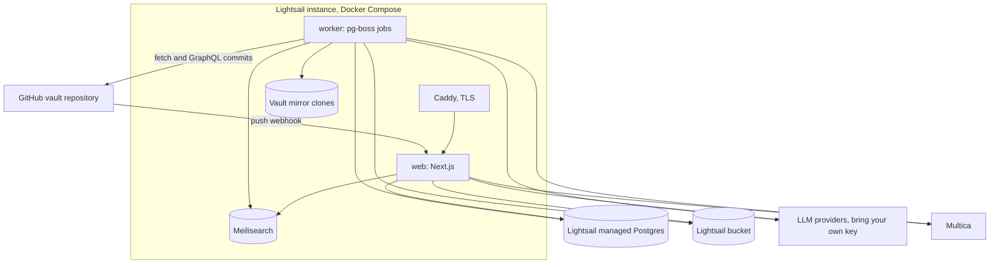
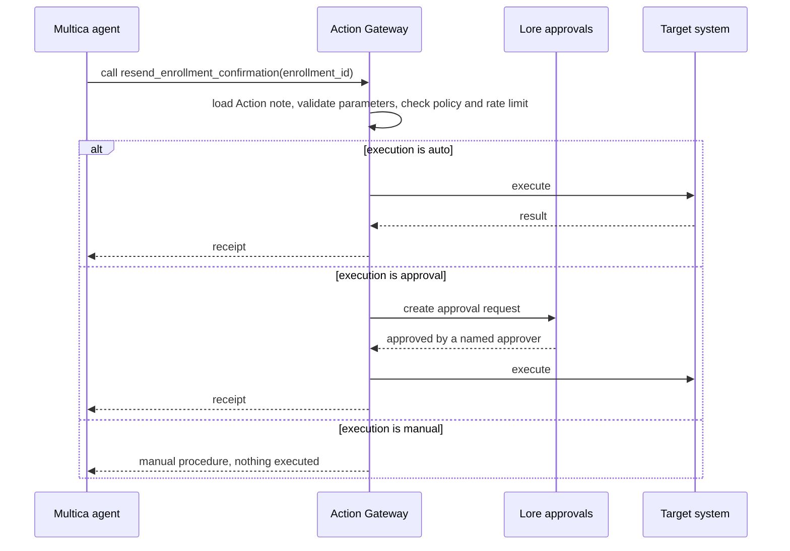

# Lore: Tech Stack and Architecture

How to build the product described in PRD.md. One choice per layer, with the reason for it and the way out if it does not work.

| Item | Value |
|---|---|
| Status | Draft 1.0, ready for build planning |
| Date | 23 September 2026 |
| Companion | PRD.md (what to build and why) |

---

## 1. Research findings that shaped the stack

| Topic | Finding | What Lore does |
|---|---|---|
| Retrieval quality | Hybrid search (BM25 plus vectors) with reranking is the production default. Graph and agentic retrieval pay off only for failure modes that evaluation actually shows | Hybrid search in Meilisearch, optional reranker, a golden question set from day one, agentic retrieval only in phase 3 |
| Contextual retrieval | Anthropic reported that adding chunk context before embedding cut failed retrievals by 35 percent, by 49 percent when BM25 also used the context, and by 67 percent with reranking on top | Every chunk gets a deterministic contextual header built from frontmatter and its heading path. No model cost, because atomic notes already carry their context. Plus generated example questions per note |
| Maps for agents | graphify builds a graph and a report (most connected nodes, communities, gaps) and hooks coding agents to read the report before grepping | `kb index` writes index files, `graph.json`, and `graph-report.md`; AGENTS.md sends agents there first |
| Intent routing | Embedding-based semantic routers classify with one vector lookup and reach roughly 92 to 96 percent precision after tuning. SetFit trains from a few examples, runs far faster than an LLM, and lands within about 8 to 10 points of LLM F1. Cascades send only uncertain cases to a model | Rules, then nearest neighbours on embeddings, then a small model; logistic regression on embeddings once examples accumulate |
| OKF v0.2 | Only `type` is required. Provenance, trust, and lifecycle fields are optional. Consumers must preserve unknown keys and tolerate broken links. `index.md` and `log.md` are reserved | Lore fields are extra keys. The linter is strict about Lore's own rules and lenient about OKF's optional parts |
| Search engine | Meilisearch supports hybrid search with a tunable `semanticRatio`, user-provided vectors, filters and facets, and a similar-documents endpoint | One engine for Library search, Desk retrieval, related notes, and duplicate checks; no separate vector database |
| Auth | Better Auth's organization plugin has teams and custom roles, but its access control is per resource type, not per record | Organization roles for administration plus Lore's own `namespace_grants` table |
| Ticketing | Multica is open source, self-hostable with Docker Compose and Postgres, assigns issues to coding-agent CLIs, and is still pre-1.0 | Adapter, local ticket mirror, polling fallback, pinned version |
| Document extraction | MarkItDown handles Office files well but loses headings and tables in PDFs. Docling preserves structure but is a heavier Python service. Marker wants a GPU | Deterministic converters for Office formats, a multimodal model for PDFs and images, Docling as an optional sidecar |
| LLM cost | Anthropic's batch API costs 50 percent less and stacks with prompt caching; cache reads cost about a tenth of normal input | Batch for extraction, atomizing, doc2query, and the Gardener; stable prompt prefixes everywhere |
| LLM providers | The AI SDK (v7) covers Anthropic, OpenAI, and Google, and the OpenRouter provider supports v7 including embeddings. Anthropic offers no embeddings API | AI SDK for every real-time call; embeddings from OpenAI, Google, OpenRouter, Voyage, or a local model |
| Hosting | Lightsail bundles have fixed monthly prices; the Lightsail container service has no persistent storage | A Lightsail instance with Docker Compose and volumes, plus managed Postgres and a bucket |

---

## 2. Stack at a glance

| Layer | Choice | Why |
|---|---|---|
| Language and runtime | TypeScript on Node.js 24 LTS | One language for the web app, worker, and CLI; the AI SDK and Better Auth are TypeScript-first |
| Monorepo | pnpm workspaces and Turborepo | Shared packages for web, worker, and CLI, with cached builds |
| Web framework | Next.js App Router | Server rendering for note pages, route handlers for the API and webhooks, streaming for the Desk |
| UI | Tailwind CSS v4, shadcn/ui, AI Elements for chat | Components the team owns, and a chat kit built for the AI SDK |
| Editor | CodeMirror 6 with a markdown live preview | Markdown stays the source, so files round-trip exactly. Obsidian's own editor is built on CodeMirror 6. Milkdown is the fallback if people insist on WYSIWYG |
| Markdown | unified, remark, rehype (GFM, frontmatter, sanitize) | The standard syntax-tree toolchain for parsing, linting, and rendering |
| YAML | The `yaml` package with its Document API | Preserves comments, key order, and unknown keys, which OKF requires |
| Graph | graphology with Louvain communities, Sigma.js for WebGL rendering | In-memory graph analysis and a renderer that handles 20,000 nodes |
| Auth | Better Auth with organization (teams), admin, and SSO plugins | Self-hosted, no per-user fees, works on any Postgres |
| Database | PostgreSQL 16 or later with Drizzle ORM | Lightsail managed today, Supabase or any Postgres later |
| Jobs | pg-boss | A Postgres-backed queue, so no Redis |
| Search and vectors | Meilisearch, self-hosted, pinned version | Keyword, vector, and hybrid search in one engine |
| LLM access | AI SDK v7 with the Anthropic, OpenAI, Google, and OpenRouter providers; provider SDKs for batch APIs | Bring your own key, one interface, structured output |
| Embeddings | Provider embeddings through the AI SDK; optional local model with transformers.js | Anthropic has no embeddings API; a local model keeps semantic search working without any provider |
| Extraction | mammoth plus turndown (DOCX), SheetJS (XLSX and CSV), JSZip (PPTX), a multimodal model (PDF and images), optional Docling sidecar | Deterministic wherever possible |
| Git | GitHub App, Octokit, GraphQL `createCommitOnBranch`, git CLI mirrors in the worker | Atomic multi-file commits without a working copy on the web server |
| CLI search | A compact cached index built into the CLI | Full-text search over the vault with no server. MiniSearch was too slow to load at 20,000 notes (`docs/decisions/0002-kb-query-index.md`) |
| Secret scanning | secretlint | The same rules in CI, the CLI, and the pipeline |
| Email | Amazon SES | Cheap and already on AWS |
| Observability | pino logs, an `llm_usage` table, optional Sentry and Langfuse | Enough for a lean team |
| Testing | Vitest, Playwright, a retrieval evaluation harness | Unit, end-to-end, and search quality |
| Hosting | Lightsail instance with Docker Compose, Lightsail managed Postgres, Lightsail bucket | Simple operations and predictable cost |
| CI/CD | GitHub Actions, images in GitHub Container Registry | Where the code and the vaults already live |

---

## 3. Runtime architecture



Three flows cover almost everything.

Reading. The browser calls the web app, which checks the session, loads the user's readable namespaces (cached per request), and reads note metadata and bodies from Postgres or queries Meilisearch with a namespace filter. The web container never touches Git or the file system, so it stays stateless.

Writing. The editor, Upload, Capture, and the Gardener create changesets in Postgres. A worker job validates the changeset, commits it through the GitHub GraphQL API, and the push webhook then triggers the indexer, which fetches the mirror, diffs the old and new heads, parses the changed files, updates Postgres, embeds new chunks, and updates Meilisearch. The editor shows the saved version straight away while this runs, which typically takes a few seconds.

A Desk turn. The route handler applies rules, embeds the message once, classifies it, retrieves from Meilisearch, streams the answer from the model assigned to the task, validates citations, and stores the turn with its routing decision, citations, and usage.

---

## 4. Repositories

Each company has one vault repository, plus an optional confidential vault. Both companies share one product repository. Multica runs from its upstream images.

```text
lore/
  apps/
    web/          Next.js: Library, Desk, Admin, API routes, webhooks
    worker/       pg-boss jobs: index, ingest, commit, batch polling, Gardener, ticket sync
  packages/
    okf/          parse, validate, and serialize notes; profile schema; link graph
    cli/          the kb command, published privately
    db/           Drizzle schema, migrations, repositories
    auth/         Better Auth setup, permission helpers
    search/       Meilisearch client, index settings, query builders
    ai/           provider registry, task routing, budgets, usage logging, batch clients
    ingest/       extractors, atomizer, validation pipeline
    desk/         routing cascade, retrieval, answering, intake state machine
    git/          GitProvider interface, GitHub implementation, commit builder, mirrors
    tickets/      TicketProvider interface and Multica adapter
    mcp/          MCP server and Action Gateway (phase 3)
    ui/           shared components
  eval/           golden sets, retrieval and answer evaluation scripts
  deploy/         docker-compose.yml, Caddyfile, env template, scripts
```

---

## 5. OKF toolkit and the `kb` CLI

`packages/okf` is the core of the system: the CLI, CI, the indexer, and the ingestion pipeline all use it. It parses notes with remark and the `yaml` Document API, so a parse and serialize round trip preserves comments, key order, and keys it does not recognise. When it writes frontmatter it uses a stable key order (type, title, description, id, version, themes, systems, tags, owner, aliases, resource, status, generated, verified, stale_after, sources, then everything else), which keeps diffs small. It also converts wikilinks, resolves links to note ids, and builds the link graph.

The vault profile tells the toolkit what this company's vault allows:

```yaml
# .kb/profile.yaml
okf_version: "0.2"
bundle_root: kb
id_prefix: kb_
required: [type, title, description, id, version, themes]
limits: { words_warn: 1200, words_error: 2500, max_tags: 8, max_themes: 3, image_max_mb: 2 }
types:
  How-To:          { review_days: 180, desk: answer }
  Process:         { review_days: 180, desk: answer }
  Explanation:     { review_days: 365, desk: answer }
  Reference:       { review_days: 365, desk: answer }
  Policy:          { review_days: 365, desk: answer }
  Decision:        { desk: answer }
  Runbook:         { review_days: 180, desk: team }
  Request Type:    { review_days: 365, desk: intake }
  Action:          { review_days: 180, desk: none }
  Theme:           { desk: navigate }
  System:          { review_days: 365, desk: navigate }
  Source Document: { desk: none }
  Graph Report:    { desk: none }
teams: [admissions-ops, finance-systems, it-support, people-ops]
custom_fields:
  - { name: audience, type: enum, values: [all-staff, managers, faculty], required: false }
```

The `desk` value tells the Desk how to use each type: `answer` can be cited, `team` is cited only for people who can write in the namespace, `intake` drives intake forms, `navigate` is used for links only, and `none` keeps the type out of the Desk. The `teams` list lets the CLI validate `owner` values offline; Lore updates it when admins add teams.

The same lint code runs in `kb lint`, in CI, and in the ingestion pipeline:

| Check | Level | Fixed by `--fix` |
|---|---|---|
| Frontmatter parses and `type` is present (OKF conformance) | Error | No |
| Lore's required fields are present | Error | Adds `id` and `version` |
| Types, themes, systems, tags, and owners exist in the vocabulary | Error | Replaces aliases with canonical terms |
| The namespace folder is registered in `namespaces.yaml` | Error | No |
| Wikilinks | Warning | Converts them to standard links |
| Link targets exist | Warning, listed as wanted notes | No |
| Word count within limits | Warning or error | No |
| Duplicate ids, or duplicate titles within a namespace | Error | No |
| Deprecated notes have `superseded_by` | Error | No |
| Actions have valid `parameters`, a Manual procedure section, and a Rollback section | Error | No |
| Request Type `fields` are valid | Error | No |
| Reserved files follow OKF (no frontmatter in `index.md` except the root `okf_version`) | Error | Regenerates them |
| Secrets (secretlint rules) | Error | No |
| Referenced images exist and are within the size limit | Warning | No |
| Generated hub member lists are current | Warning | Regenerates them |

| Command | What it does |
|---|---|
| `kb lint [--fix] [paths]` | Validate notes and fix what is safe to fix |
| `kb new <type> "<title>" --ns <namespace> --theme <theme>` | Create a note from the type's template with a fresh id |
| `kb query "<text>"` | Offline full-text search over the vault (a cached index, see decision 0002), printing paths and descriptions, with namespace and type filters |
| `kb related <path or id>` | Linked and similar notes; `--remote` uses the Lore API for semantic similarity |
| `kb index` | Regenerate index files, hub member lists, `graph.json`, and `graph-report.md` |
| `kb mv <from> <to>` | Move or rename a note and rewrite inbound links |
| `kb bump <path> --class <fix, addition, or process>` | Bump the version and, for process changes, write the log entry |
| `kb verify <path>` | Add a human verification and set `stale_after` from the type's review interval |
| `kb taxonomy <list, add, rename, or merge>` | Manage the vocabulary, rewriting notes where needed |
| `kb migrate` | Upgrade a vault to a new profile or OKF version |

The CLI identifies people as `human:<id>`, taking the id from the `KB_ACTOR` environment variable or from the local part of the Git email. Agents set `KB_ACTOR` to `<agent>/<model>`, for example `claude-code/claude-sonnet-5`, which follows the OKF actor convention.

---

## 6. Git integration

Each company installs the Lore GitHub App on its vault repositories with read and write access to contents, read access to metadata, and push and pull request webhooks.

Writing. The worker turns a changeset into a single GraphQL `createCommitOnBranch` call with `expectedHeadOid` set to the head it validated against. The mutation adds, updates, and deletes several files atomically, and GitHub signs commits made by apps. If the head has moved, the worker re-fetches and checks whether any file in the changeset changed (by blob SHA). If none did, it retries, up to three times; otherwise it marks the changeset conflicted. Commit messages follow a fixed format that both people and tools can read:

```text
kb(admissions): update "Enroll a returning student in Salesforce"

Change-Class: process
Changeset: cs_01J9ZB4M3FQ8R2T6V0X4Z8C2E6
Source: library-editor

Co-authored-by: Maria Reyes <maria.reyes@acme.edu>
```

Very large changesets, such as uploads with many images, may exceed the mutation's payload limit. The fallback is the REST Git Data API (create blobs, a tree, a commit, then update the ref), which the spike in section 20 confirms.

Reading. The worker keeps a mirror clone per vault on a volume. It fetches on every push webhook (verified with the webhook secret) and every 5 minutes as a safety net. The indexer diffs the previous indexed head against the new one, parses only the changed files, updates Postgres and Meilisearch, and removes deleted notes. `lore reindex --all` rebuilds everything from the mirror, reusing cached embeddings.

Generated files. CI regenerates index files, hub member lists, and the graph files on every push to main and commits them back. Lore's own commits never include generated files, so there is exactly one generator. Because unchanged chunks keep their content hash, re-indexing a commit that only touched generated files costs almost nothing.

```yaml
# .github/workflows/kb.yml in each vault
name: kb
on:
  pull_request:
  push:
    branches: [main]
permissions:
  contents: write
jobs:
  lint:
    runs-on: ubuntu-latest
    steps:
      - uses: actions/checkout@v4
      - uses: actions/setup-node@v4
        with: { node-version: 24 }
      - run: npx -y @yourorg/kb@1 lint
  index:
    if: github.event_name == 'push' && !contains(github.event.head_commit.message, '[skip ci]')
    needs: lint
    runs-on: ubuntu-latest
    steps:
      - uses: actions/checkout@v4
      - uses: actions/setup-node@v4
        with: { node-version: 24 }
      - run: npx -y @yourorg/kb@1 index
      - name: Commit regenerated files
        run: |
          git add -A
          if ! git diff --cached --quiet; then
            git config user.name "lore-bot"
            git config user.email "lore-bot@users.noreply.github.com"
            git commit -m "kb: regenerate indexes [skip ci]"
            git push
          fi
```

If branch protection blocks the workflow's push, use a GitHub App token for that step or add the workflow to the bypass list. `@yourorg/kb` stands for wherever the CLI is published privately, for example GitHub Packages.

Pull request mode is optional per vault. Lore then commits each changeset to a branch, opens a pull request, and enables auto-merge so it merges once CI passes. The default is direct commits to main, with the app on the branch protection bypass list.

GitHub sits behind a small `GitProvider` interface (read a file, list changes between commits, commit a changeset, open a pull request, verify a webhook), so GitLab or Bitbucket can be added later without touching the rest of the system.

---

## 7. Data layer

Postgres holds application data and a parsed copy of every note. Everything in the note tables can be rebuilt from the vault; everything else is backed up.

| Table | Purpose |
|---|---|
| Better Auth tables (user, session, account, verification, organization, member, team, team member, invitation) | Identity, managed by Better Auth |
| `vaults` | Repository, branch, bundle root, GitHub installation, last indexed head |
| `namespaces` | Slug, title, visibility, publishing mode, AI processing flag, owner team |
| `namespace_grants` | Namespace, principal (team or user), level (read, write, maintain) |
| `notes` | Id, path, namespace, type, title, description, full frontmatter (JSONB), body, version, status, trust tier, `stale_after`, `generated`, content hash, blob SHA, word count, health score |
| `note_links` | Source note, target path, resolved target id (null when broken), kind (body, hub, supersedes) |
| `taxonomy_terms` | Kind (theme, system, tag), slug, title, aliases, state (active, proposed, retired) |
| `changesets` | Submitter, source (editor, suggest, upload, capture, gardener, agent), change class, state, base blob SHAs, operations (JSONB), AI summary, warnings, commit SHA |
| `ingest_items` | Changeset, file key, file type, hash, extraction state, batch id |
| `reviews` | Changeset, reviewer, decision, comment |
| `feedback` | Note, person, kind (helpful or report), reason, comment, state |
| `follows`, `notifications` | Followed notes and hubs; in-app notifications |
| `desk_sessions` | Person, state, counters, timestamps |
| `desk_messages` | Session, role, content, intent, routing stage, citations, model, tokens, latency |
| `intent_exemplars` | Text, intent, request type, source (seed, vault, approved), embedding |
| `tickets` | Provider, external id, session, requester, request type, status, last public update, next allowed status request |
| `ticket_events` | Ticket, kind (created, comment, status, nudge, cancel), public flag, body |
| `llm_usage` | Task, provider, model, input, output, and cached tokens, cost, person, namespace, latency, batch flag |
| `embedding_cache` | Model, content hash, vector |
| `settings` | Deployment configuration, with provider keys encrypted by the app key |
| `audit_log` | Actor, action, target, metadata, time |
| `action_runs` (phase 3) | Action, ticket, parameters, policy, approvals, receipt, state |

A parsed copy of each note in Postgres lets the web app render pages, join permissions, and build graphs without file access. The embedding cache lives in Postgres so Meilisearch can be rebuilt without paying for embeddings again. At 1,024 dimensions, the largest target vault (20,000 notes, about 150,000 chunks) needs roughly 700 MB; a typical vault needs far less.

Migrations use Drizzle Kit, and every schema change is additive first (expand now, contract in a later release), so rolling back means deploying the previous image.

---

## 8. Auth and permissions

Better Auth runs inside the web app with the Drizzle adapter. Each deployment has exactly one organization, the company, and uses the organization plugin mainly for its roles and teams.

```ts
// packages/auth/index.ts (sketch; confirm option names against current Better Auth docs)
import { betterAuth } from "better-auth";
import { drizzleAdapter } from "better-auth/adapters/drizzle";
import { organization, admin } from "better-auth/plugins";
import { sso } from "@better-auth/sso";

export const auth = betterAuth({
  database: drizzleAdapter(db, { provider: "pg" }),
  socialProviders: {
    google: { clientId: env.GOOGLE_CLIENT_ID, clientSecret: env.GOOGLE_CLIENT_SECRET },
    microsoft: {
      clientId: env.MICROSOFT_CLIENT_ID,
      clientSecret: env.MICROSOFT_CLIENT_SECRET,
      tenantId: env.MICROSOFT_TENANT_ID,
    },
  },
  plugins: [organization({ teams: { enabled: true } }), admin(), sso()],
  databaseHooks: {
    user: {
      create: {
        // Only company email domains may sign in
        before: async (user) => (isAllowedDomain(user.email) ? { data: user } : false),
      },
    },
  },
});
```

Namespace permissions live in Lore's own table because Better Auth's access control works per resource type, not per record. Every server-side read goes through two helpers:

```ts
type Level = "read" | "write" | "maintain";

// Company namespaces plus restricted ones granted to the user or their teams.
// Admins get everything. Cached for the duration of the request.
export async function readableNamespaces(userId: string): Promise<string[]>;

// Throws a 403 unless the user holds at least `level` on the namespace.
export async function requireNamespace(userId: string, namespace: string, level: Level): Promise<void>;
```

Search, Desk retrieval, related notes, the graph, exports, and the MCP server all build their filters from `readableNamespaces`. Service accounts are Better Auth users flagged as service identities, with API tokens and their own grants. Better Auth's built-in rate limiting protects sign-in, and the Desk adds its own quotas.

---

## 9. Search with Meilisearch

Each vault has two indexes:

| Index | One document per | Main fields | Used by |
|---|---|---|---|
| `notes` | Note | Title, aliases, description, body excerpt, type, namespace, themes, systems, tags, trust tier, status, stale flag, health, `desk` use, update time, and a card vector | Library search, similar notes, navigation answers, duplicate checks |
| `chunks` | Section of a note | Contextual header, text, note id, heading path, position, the note's filter fields, and a chunk vector | Desk retrieval |

The card vector embeds the title, description, aliases, and generated example questions (doc2query), which suits short, question-like searches. A chunk vector embeds the contextual header plus the chunk text.

Lore computes every vector itself with the AI SDK and hands it to Meilisearch through a `userProvided` embedder, with each document carrying its vector in `_vectors`. This keeps provider keys out of Meilisearch, lets any provider or a local model produce the vectors, and makes the embedding cache possible.

```ts
await meili.index("chunks").updateSettings({
  searchableAttributes: ["header", "text"],
  filterableAttributes: ["namespace", "type", "status", "trust_tier", "stale", "desk", "themes", "systems", "tags", "note_id"],
  embedders: { default: { source: "userProvided", dimensions: 1024 } },
});

const teamFilter = writable.length
  ? `desk = answer OR (desk = team AND namespace IN [${writable.join(", ")}])`
  : "desk = answer";

const results = await meili.index("chunks").search(query, {
  vector: queryVector, // the same vector the intent classifier used
  hybrid: { embedder: "default", semanticRatio: 0.6 },
  filter: [`namespace IN [${readable.join(", ")}]`, "status = stable", teamFilter],
  limit: 40,
  showRankingScore: true,
});
```

The semantic ratio starts at 0.3 for the Library, where people type keywords and titles, and 0.6 for the Desk, where people ask questions; the spike in section 20 tunes both. If embeddings are unavailable, queries run without the hybrid parameter, which is plain keyword search. Synonyms come from tag aliases and note aliases, and typo tolerance stays on. Related notes use Meilisearch's similar-documents endpoint on the `notes` index.

Meilisearch listens only on the Docker network. The worker uses an admin key, the web app uses a search-only key, and the browser never talks to Meilisearch directly.

---

## 10. Retrieval pipeline

### 10.1 Chunking

1. Parse the note into a markdown syntax tree and split it at H1 to H3 headings. Each section keeps its heading path.
2. Keep lists, tables, and code blocks whole. A numbered procedure stays one chunk unless it exceeds 700 tokens, in which case it splits between list items with the heading repeated.
3. Merge sections shorter than 80 tokens into a neighbour.
4. Split sections longer than 700 tokens into chunks of 400 to 600 tokens at paragraph boundaries. There is no overlap; the heading path is repeated instead.
5. Resolve footnote markers to their source titles in the chunk metadata.

Each chunk gets a deterministic contextual header, stored in its own field so that both keyword and vector search use it:

```text
Note: Enroll a returning student in Salesforce (How-To, admissions)
Summary: Reactivate a former student's record and open a new enrollment without creating a duplicate contact.
Themes: enrollment. Systems: salesforce, sis.
Section: Steps
```

This is Anthropic's contextual retrieval idea without a model call per chunk. Atomic notes with required descriptions already carry the context that the technique normally asks a model to write.

### 10.2 Query pipeline

1. Rewrite follow-up messages into standalone queries with the small model, using the last turns. First messages skip this step.
2. Embed the query once and share the vector with the intent classifier.
3. Run hybrid search on `chunks` (40 results) and on note cards (10 results) with permission and status filters.
4. Group results by note and score each note, starting from this formula:

```text
note_score  = best_chunk + 0.5 * second_best_chunk + 0.3 * card_score
multipliers = human-reviewed 1.10, unverified 0.95, stale 0.85,
              open "incorrect" or "outdated" report 0.70
```

5. Expand along links. For the top 3 notes, linked notes that also matched the query are added at 0.6 times their own score. This is how atomic notes come together: a question about enrolling a returning student also pulls in the linked note on cleaning up duplicate contacts.
6. Rerank, optionally, with a hosted cross-encoder (Cohere, Voyage, or Jina, using the company's key) or a small-model listwise pass over the top 20 chunks. It stays off until evaluation shows a gain.
7. Assemble up to about 6,000 tokens of context, grouped by note with title, id, trust tier, and last update. Notes under 800 tokens go in whole, which is common for atomic notes.
8. Generate with the small model when one note covers the question and the mid-size model when several do, using structured output:

```ts
const Answer = z.object({
  answer: z.string().max(2400),
  citations: z.array(z.object({ noteId: z.string(), section: z.string().optional() })).max(6),
  confidence: z.enum(["high", "medium", "low"]),
  next: z.enum(["none", "open_note", "offer_request"]),
});
```

9. Validate in code. Every citation must point to a retrieved note, invalid citations are removed, an answer with no valid citation becomes a list of links, and low confidence adds the offer to file a request.
10. Add disclosures in code for unverified, stale, reported, and recently changed notes.

### 10.3 Multi-step retrieval (phase 3)

For questions the router marks as complex, or after a low-confidence first pass, the model gets three read-only tools (`search`, `open_note`, `related`) through AI SDK tool calling, with a hard limit of three steps. The same permission filters apply to every tool.

### 10.4 Evaluation

Each vault keeps a golden set in `.kb/eval/questions.yaml`:

```yaml
- q: How do I re-enroll a student who left last year?
  intent: question
  expect_notes: [kb_01J9Z6Q4X8M2T7C3VQ5R1N0B8D]
- q: can you give my new hire NetSuite AP access
  intent: request
  expect_request_type: kb_01J9Z7K2M4P6R8T0V2X4Z6B8C9
- q: whats the weather tomorrow
  intent: off_topic
```

Start with about 30 real questions per company taken from past support requests, and add a candidate every time someone rates a Desk answer as unhelpful. The harness reports recall at 5, MRR, intent precision and recall per class, groundedness on a sample (a model judge plus human spot checks), and cost and latency per message. It runs on every change to retrieval code in the product repository and weekly against each live vault, and Admin shows the results.

---

## 11. Intent routing without a large model

| Stage | Technique | Cost | Decides when |
|---|---|---|---|
| 0. Rules | Commands, ticket references, greetings, length and quota checks | Nothing | A rule matches |
| 1. Nearest neighbours | Cosine similarity between the message vector and labelled examples, with a similarity-weighted vote of the top 7 | The embedding the Desk needs anyway | The top intent clears its threshold and beats the runner-up by at least 0.1 |
| 2. Small model | Structured classification over the intent list and the top 5 candidate request types | About $0.001 per message | Everything else |
| Later | Logistic regression on embeddings, retrained weekly from approved examples; SetFit exported to ONNX only if accuracy plateaus | Nothing at inference time | Replaces stage 1 |

Examples come from three places: a generic seed set shipped with Lore (greetings, off-topic, status, and generic request and incident phrasing), the `examples` on each company's Request Type notes, and messages that maintainers approved. They live in Postgres with their embeddings and load into memory. Comparing against a few thousand vectors by brute force takes a few milliseconds, so no vector database is needed. A job recalibrates the per-intent thresholds whenever examples change, picking for each intent the lowest threshold that keeps precision at 0.95 or higher on the evaluation set.

```ts
type Intent =
  | "question" | "navigate" | "troubleshoot" | "incident"
  | "request" | "status" | "smalltalk" | "off_topic";

export async function route(message: string, ctx: SessionContext): Promise<Route> {
  const byRule = applyRules(message, ctx);
  if (byRule) return byRule;

  const vector = await embed(message); // reused for retrieval
  const knn = classifier.predict(vector); // weighted top-7 vote
  if (knn.score >= thresholds[knn.intent] && knn.margin >= 0.1) {
    return { ...knn, stage: "knn", vector };
  }
  const llm = await classifyWithSmallModel(message, ctx, knn.candidates);
  return { ...llm, stage: "llm", vector };
}
```

Every decision is logged with its stage and scores, and those logs become the data for improving the classifier.

---

## 12. LLM layer

`packages/ai` wraps the AI SDK with a provider registry built from the company's encrypted keys, a task router, budgets, and usage logging. Tasks name their models in configuration rather than in code:

```yaml
# Stored in settings and edited in Admin; shown as YAML for readability
tasks:
  desk.classify:      { primary: anthropic:claude-haiku-4-5-20251001, fallback: openai:<mini model> }
  desk.rewrite:       { primary: anthropic:claude-haiku-4-5-20251001 }
  desk.answer.single: { primary: anthropic:claude-haiku-4-5-20251001, fallback: google:<flash model> }
  desk.answer.multi:  { primary: anthropic:claude-sonnet-5, fallback: openrouter:<model> }
  desk.intake:        { primary: anthropic:claude-haiku-4-5-20251001 }
  ingest.extract:     { primary: anthropic:claude-sonnet-5, batch: true }
  ingest.atomize:     { primary: anthropic:claude-sonnet-5, batch: true }
  ingest.doc2query:   { primary: anthropic:claude-haiku-4-5-20251001, batch: true }
  gardener.propose:   { primary: anthropic:claude-sonnet-5, batch: true }
embeddings: { model: openai:<embedding model>, dimensions: 1024 }
budgets: { org_monthly_usd: 150, alert_at: 0.8 }
```

The fallback model is used when the primary errors, times out, or hits a rate limit. If both fail, the Desk switches to search-only mode.

Batch work does not go through the AI SDK. The worker groups pending batch tasks per provider every 2 hours, submits them with each provider's own SDK (Anthropic Message Batches, OpenAI Batch, Gemini batch mode), polls every 10 minutes, and writes the results back to changesets. Providers complete batches within 24 hours, usually much sooner. If a company has only configured OpenRouter, which has no batch API, batch tasks run as normal calls at full price.

Prompts are assembled with stable content first (instructions, then vocabulary and profile, then retrieved notes, then the question), so Anthropic prompt caching, set through provider options, and the automatic prefix caching of other providers both apply. Structured outputs use zod schemas. A middleware writes one `llm_usage` row per call and prices it from a per-model price table that includes batch discounts and cache rates. Before each call, the router checks the company's monthly budget, the task budget, and the person's daily quota.

Keys never reach the browser and are encrypted at rest with AES-256-GCM using `APP_ENCRYPTION_KEY`. Admins can test a key and see which tasks use it.

---

## 13. Desk implementation

The session state machine (PRD section 10.2) is a plain TypeScript reducer in `packages/desk`, with state persisted in `desk_sessions`, so every transition can be tested without a model. The chat interface uses the AI SDK's `useChat` hook with AI Elements components, streaming from a Next.js route handler.

Intake does not use model tool calling. The Request Type's `fields` become a zod schema at runtime, the small model fills that schema from the conversation as structured output, and code decides what to ask next, using each field's label as the question. The confirmation card is a React component with editable fields, and filing happens only when the user presses Confirm.

After filing, the message box is not rendered for sessions in the filed, cancelled, or resolved states. The three post-filing actions call dedicated routes (`POST /api/tickets/:id/updates`, `POST /api/tickets/:id/cancel`, and `POST /api/tickets/:id/status-request`), and the status request route rejects calls made before the ticket's next allowed status request time.

```ts
export interface TicketProvider {
  createTicket(input: {
    title: string;
    body: string; // markdown: summary, fields, conversation summary, related notes
    requester: { id: string; email: string; name: string };
    requestTypeId?: string;
    routeTo: string; // from the Request Type's route_to
    priority?: "low" | "normal" | "high" | "urgent";
    labels?: string[];
  }): Promise<{ externalId: string; url: string }>;

  addComment(externalId: string, body: string, opts: { public: boolean; authorName?: string }): Promise<void>;
  cancel(externalId: string, reason: string): Promise<void>;
  get(externalId: string): Promise<TicketSnapshot>;
  listUpdatedSince(since: Date): Promise<TicketSnapshot[]>;
  parseWebhook?(request: Request): Promise<TicketEvent[]>;
}

export interface TicketSnapshot {
  externalId: string;
  status: "received" | "in_progress" | "waiting_on_requester" | "resolved" | "cancelled";
  assignee?: string;
  publicComments: { id: string; author: string; body: string; at: Date }[];
  updatedAt: Date;
}
```

The Multica adapter maps `routeTo` to a Multica workspace, project, or label, translates statuses using the mapping in settings, and decides which comments are public using the convention settled in the spike. A sync job calls `listUpdatedSince` every 60 seconds unless webhooks are available. Requesters get an in-app notification and an email when a public comment arrives or the status changes.

---

## 14. Agent access

### 14.1 AGENTS.md and the kb-writer skill

The vault's AGENTS.md is short and points agents at the map:

```markdown
# Working in this vault

This repository is an OKF v0.2 knowledge bundle in `kb/`.

Before searching:
1. Read `kb/index.md` for namespaces, themes, and systems.
2. Read `kb/_meta/graph-report.md` for hubs, clusters, and gaps.
3. Use `kb query "<words>"` and `kb related <note>` before grepping.

When writing notes, follow `.agents/skills/kb-writer/SKILL.md`.
Never invent namespaces, themes, systems, or tags; run `kb taxonomy list`.
Run `kb lint --fix` before every commit.
```

The kb-writer skill walks through the writing workflow: search first and prefer updating an existing note; one idea per note; the frontmatter template for each type; bundle-absolute links and at least one hub link; `sources` entries that point at repository paths with a commit SHA when documenting code; `generated.by` set to the agent and model; never adding a `verified` entry, because verification belongs to people; running the linter; and the commit message format.

Documenting a codebase then looks like this. An engineer checks out the vault next to the code repository, runs a coding agent in the code repository, and asks it to document the enrollment sync service. The agent reads the code (running graphify on the code repository first helps with large codebases), queries the vault for existing notes, writes or updates atomic notes whose `sources` point at the files it read, runs `kb lint --fix`, and pushes or opens a pull request.

### 14.2 MCP server (phase 3)

The Lore MCP server gives any MCP-capable agent access to the vault with the caller's permissions: search with filters, get a note by id or path, list related notes, list the taxonomy, get a Request Type, and propose a changeset, which always lands in review. The root index and the graph report are exposed as resources. Service accounts authenticate with tokens, and people authenticate with OAuth through Lore.

### 14.3 Action Gateway (phase 3)

The Gateway is a separate MCP server offered to Multica agents. It generates one tool per stable, human-reviewed Action note, with the input schema built from the note's `parameters`. Executors are TypeScript handlers registered under the note's `executor.resource` (for example `gateway://salesforce/resend-enrollment-confirmation`), and credentials come from the Gateway's secret store, never from the vault.



Every run writes an `action_runs` row and an audit entry, and posts the receipt to the ticket.

---

## 15. Deployment on AWS Lightsail

| Resource | Plan | Monthly |
|---|---|---|
| Instance running web, worker, Meilisearch, and Caddy | Linux, 8 GB RAM, 2 vCPUs, 160 GB SSD | $44 |
| Managed PostgreSQL | Standard 2 GB plan, which includes encryption at rest | $30 |
| Object storage bucket | 100 GB plan | $3 |
| Instance snapshots | Daily automatic snapshots, kept 7 days | About $5 to $10 |
| Lore infrastructure total | | About $82 to $87 |
| Multica | A separate 4 GB instance, or Multica's hosted service, with agent runtimes on existing machines | About $24 |

One instance keeps operations simple. Meilisearch needs most of the memory, and 8 GB fits Meilisearch, Next.js, and the worker at the target scale. When load grows, move Meilisearch to its own 4 GB instance or to Meilisearch Cloud, then split out the worker. Enabling the Docling sidecar calls for the 16 GB instance ($84). The Lightsail container service is not used because it cannot keep persistent volumes, which Meilisearch data and the vault mirrors need. The managed database brings automatic backups with point-in-time restore, and the 2 GB plan is the smallest one that encrypts data at rest.

```yaml
# deploy/docker-compose.yml
services:
  caddy:
    image: caddy:2
    ports: ["80:80", "443:443"]
    volumes:
      - ./Caddyfile:/etc/caddy/Caddyfile:ro
      - caddy_data:/data
    depends_on: [web]
    restart: unless-stopped
  web:
    image: ghcr.io/yourorg/lore-web:${LORE_VERSION}
    env_file: .env
    depends_on: [meilisearch]
    restart: unless-stopped
  worker:
    image: ghcr.io/yourorg/lore-worker:${LORE_VERSION}
    env_file: .env
    volumes:
      - vaults:/data/vaults
    depends_on: [meilisearch]
    restart: unless-stopped
  meilisearch:
    image: getmeili/meilisearch:${MEILI_VERSION}
    environment:
      MEILI_ENV: production
      MEILI_MASTER_KEY: ${MEILI_MASTER_KEY}
      MEILI_NO_ANALYTICS: "true"
    volumes:
      - meili_data:/meili_data
    restart: unless-stopped
  docling: # optional, only when Docling extraction is enabled; confirm the current image name
    image: quay.io/docling-project/docling-serve:${DOCLING_VERSION}
    profiles: ["docling"]
    restart: unless-stopped
volumes:
  caddy_data: {}
  vaults: {}
  meili_data: {}
```

| Variable | Purpose |
|---|---|
| `DATABASE_URL` | Postgres connection (direct or session mode for the worker) |
| `BETTER_AUTH_SECRET`, `BETTER_AUTH_URL` | Session signing and the public URL |
| `APP_ENCRYPTION_KEY` | Encrypts provider keys and other secrets stored in settings |
| `MEILI_URL`, `MEILI_MASTER_KEY` | Search engine |
| `S3_ENDPOINT`, `S3_REGION`, `S3_BUCKET`, `S3_ACCESS_KEY_ID`, `S3_SECRET_ACCESS_KEY` | Bucket for uploads, exports, and backups |
| `GITHUB_APP_ID`, `GITHUB_APP_PRIVATE_KEY`, `GITHUB_WEBHOOK_SECRET` | Vault commits and webhooks |
| `GOOGLE_CLIENT_ID`, `GOOGLE_CLIENT_SECRET` or the `MICROSOFT_*` equivalents | Sign-in |
| `ALLOWED_EMAIL_DOMAINS` | Who may sign in |
| `SES_REGION`, `EMAIL_FROM` | Email |
| `MULTICA_URL`, `MULTICA_TOKEN` | Ticket adapter |

Model provider keys are entered in Admin rather than in the environment, so admins can rotate them without a deploy.

Backups and restore. The managed database keeps automatic backups with point-in-time restore, and a weekly `pg_dump` goes to the bucket as a portable copy. The instance takes daily automatic snapshots, which include Meilisearch data and vault mirrors even though both can be rebuilt. The vault lives in GitHub, and a nightly `git bundle` to the bucket is a cheap extra copy. A restore drill (new instance, `docker compose up`, migrations, `lore reindex --all`, smoke test) should take under 4 hours; run it once before each company goes live.

Networking. The Lightsail firewall opens only ports 80 and 443, with SSH limited to admin addresses or the browser console. The database has public mode switched off, Meilisearch is reachable only inside Docker, Caddy handles TLS certificates automatically, and GitHub webhook signatures are verified.

CI/CD. Pull requests in the product repository run lint, type checks, unit tests, a fast retrieval evaluation, and a Playwright smoke test. Merges to main build images, tag them with the version, and push them to GitHub Container Registry. A deploy job per company connects over SSH and runs:

```bash
cd /opt/lore
export LORE_VERSION=1.8.0
docker compose pull
docker compose run --rm web node scripts/migrate.mjs
docker compose up -d
```

Both companies follow one release train, and company A receives each release a day before company B as a canary.

---

## 16. Portability

Supabase needs configuration, not code. Point `DATABASE_URL` at Supabase Postgres, using the direct or session-mode connection for the worker, which runs long-lived queue polling; test pg-boss against the pooler before relying on it. Point the `S3_*` variables at Supabase Storage's S3-compatible endpoint. Keep Better Auth rather than switching to Supabase Auth, so there is only one authentication path. Run Meilisearch on Meilisearch Cloud or any VM, and the containers on any Docker host.

Convex is not a target. It is a reactive document database with its own function runtime, so moving to it would mean rewriting the data layer, the job system, and the auth integration. The part that matters most for portability, the vault, does not depend on the database at all. Data access goes through repositories in `packages/db`, so a Convex adapter stays possible if a customer ever requires it.

Every external dependency sits behind a narrow interface: `GitProvider` (GitHub today), `TicketProvider` (Multica today), AI SDK providers, the S3 API, and email (SES, with SMTP as a fallback). Knowledge stays portable without Lore: plain markdown and YAML in an OKF-conformant bundle, index files for navigation, the offline `kb` CLI, and links that Obsidian understands. App data (feedback, ticket mirror, chat history) can be exported as JSON.

---

## 17. Observability, security, and testing

Observability. Services log JSON with pino to stdout, and Docker rotates the logs; ship them to CloudWatch or a log service only when needed. Health endpoints feed an external uptime check, and Lightsail alarms cover CPU, status checks, and database storage. The `llm_usage` table powers the cost dashboard. Langfuse (self-hosted or cloud) is optional for prompt traces in staging, and Sentry is optional for errors. Admin shows Desk volume, the share of messages handled at each routing stage, cost per task, and evaluation scores.

Security. Better Auth provides CSRF protection and secure sessions. Rendered markdown goes through rehype-sanitize, and raw HTML in notes is never rendered unsanitized. Extractors never fetch URLs found inside documents. Every write path runs secretlint. Provider keys are encrypted, the GitHub App has the minimum permissions, webhooks are signature-checked, dependencies update through Renovate, and an optional ClamAV sidecar scans uploads.

Prompt injection. Extracted text and note bodies reach models as clearly delimited data. The atomizer's output is validated as structure (file operations only inside permitted namespaces, schema-checked frontmatter) before anything is committed, and nothing it produces executes. The Desk has no tools, and the Action Gateway checks policy without consulting a model.

Testing. Unit tests cover the OKF parser (property-based round trips: parse, serialize, parse again, compare), lint rules, the chunker, scoring, the routing cascade, and the session reducer. Integration tests run the indexer against a fixture vault, the commit flow against a test repository, and the Multica adapter against a local Multica in Docker. Playwright covers sign-in, search, editing, suggestions, upload review, and Desk intake. The retrieval harness from section 10.4 guards answer quality, and a simple k6 load test checks the search latency target.

---

## 18. Cost summary

| Item, per company per month | Estimate |
|---|---|
| Lore infrastructure on Lightsail | About $85 |
| Multica hosting | About $24 |
| LLM usage at 4,300 Desk messages and 100 uploads | About $40 to $45 |
| Total | About $150 |
| Both companies | About $300 |

LLM spend grows with Desk volume at under one cent per message on average, so ten times the traffic adds roughly $300 a month. GitHub, domains, and SES email are small or already paid for. PRD section 12.3 has the breakdown behind the LLM estimate.

---

## 19. What we are not using

| Not using | Why |
|---|---|
| LangChain or LlamaIndex | The AI SDK plus a few hundred lines of retrieval code are easier to read, test, and debug |
| A separate vector database (Pinecone, Qdrant, pgvector) | Meilisearch already does hybrid search, and one index is easier to keep in sync than two |
| Neo4j or LLM-extracted GraphRAG | People and agents write the links; an in-memory graphology graph handles 20,000 notes |
| Redis | pg-boss runs jobs on Postgres |
| Kubernetes | One instance per company is enough |
| Lightsail container service | No persistent volumes for Meilisearch data and vault mirrors |
| Convex | A different data model; see section 16 |
| Supabase Auth | Better Auth runs anywhere, so there is one auth path |
| TipTap or BlockNote as the main editor | Rich-text editors round-trip markdown lossily; CodeMirror keeps the file as the source |
| Fine-tuning | Retrieval and labelled examples do the job without training runs |
| MarkItDown for PDFs | It loses headings and tables in PDFs; a multimodal model or Docling does better |

---

## 20. Spikes before building

Each spike takes one to three days and has a fallback.

| Spike | Question | Fallback |
|---|---|---|
| Multica API | Can Lore create, comment on, cancel, and read issues through the API or CLI with a service token? Are there webhooks? How are public and internal comments told apart? | Polling, a comment prefix convention, a CLI wrapper |
| Obsidian links | Do bundle-absolute links resolve when `kb/` is opened as the Obsidian vault? | Relative links throughout |
| GitHub commits | Payload limits of `createCommitOnBranch` with images; branch protection with the app on the bypass list | REST Git Data API; pull request mode |
| Hybrid search tuning | The best `semanticRatio` and thresholds on 30 real questions per company | Adjust ratios; enable the reranker |
| PDF extraction | Multimodal model versus Docling on 10 real SOPs | Docling sidecar on the 16 GB instance |
| Sign-in | Better Auth with each company's identity provider, domain allowlist, and team mapping | Email magic links |
| Embedding model | A provider model at 1,024 dimensions versus a local model on the golden set | Pick the best per company |

---

## 21. References

- Open Knowledge Format v0.2 specification: https://github.com/GoogleCloudPlatform/knowledge-catalog/blob/main/okf/SPEC.md
- Google Cloud announcement of OKF: https://cloud.google.com/blog/products/data-analytics/how-the-open-knowledge-format-can-improve-data-sharing
- graphify: https://github.com/Graphify-Labs/graphify
- Multica: https://github.com/multica-ai/multica
- Multica self-hosting guide: https://github.com/multica-ai/multica/blob/main/SELF_HOSTING.md
- Anthropic, Contextual Retrieval: https://www.anthropic.com/news/contextual-retrieval
- RAG techniques compared: https://blog.starmorph.com/blog/rag-techniques-compared-best-practices-guide
- Advanced RAG techniques: https://atlan.com/know/advanced-rag-techniques/
- Intent classification for agent routers: https://tianpan.co/blog/2026/04/16/intent-classification-agent-routers
- Semantic routing and SetFit notes: https://gist.github.com/mkbctrl/a35764e99fe0c8e8c00b2358f55cd7fa
- Meilisearch hybrid search with user-provided embeddings: https://meilisearch.com/docs/capabilities/hybrid_search/how_to/search_with_user_provided_embeddings
- Meilisearch embedders: https://www.meilisearch.com/docs/learn/experimental/embedders
- Better Auth organization plugin: https://better-auth.com/docs/plugins/organization
- Amazon Lightsail pricing: https://aws.amazon.com/lightsail/pricing/
- Lightsail pricing breakdown: https://cloudburn.io/blog/amazon-lightsail-pricing
- OpenRouter provider for the AI SDK: https://github.com/OpenRouterTeam/ai-sdk-provider
- Claude batch processing: https://docs.claude.com/en/docs/build-with-claude/batch-processing
- Claude pricing: https://platform.claude.com/docs/en/docs/about-claude/pricing
- MarkItDown survey: https://yage.ai/share/markitdown-survey-en-20260412.html
- MarkItDown vs Docling vs Marker: https://www.danilchenko.dev/posts/markitdown-vs-docling-vs-marker/
