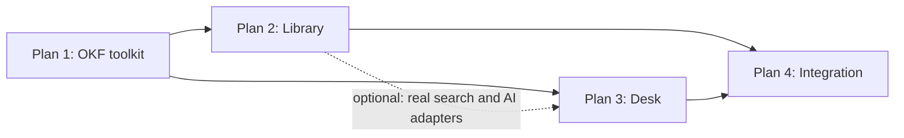

# Lore Implementation Plans: Overview

This folder splits the build described in `PRD.md` and `TECH_STACK.md` into four plans. Each plan can be built and tested on its own. The fourth plan connects the other three and takes them to production.

| # | Plan | What it delivers | Standalone test command |
|---|---|---|---|
| 1 | [OKF Vault Toolkit](01-okf-vault-toolkit.md) | `@lore/okf`, the `kb` CLI, the vault template repo, vault CI, the kb-writer agent skill, shared fixtures | `pnpm --filter @lore/okf --filter @lore/cli test` |
| 2 | [Library](02-library.md) | The Obsidian-like web app: auth, grants, indexer, search, note pages, editor, changesets, review, upload and capture, admin, worker | `pnpm dev:library` against `deploy/dev/library.compose.yml`, then `pnpm --filter web e2e` |
| 3 | [Desk](03-desk.md) | The chat helpdesk: routing cascade, retrieval, grounded answers, intake, ticket view, My tickets, Multica adapter, eval harness | `pnpm dev:desk-sandbox`, then `pnpm --filter desk-sandbox e2e` |
| 4 | [Integration and Production](04-integration.md) | Desk mounted in the Library, GitHub and Multica wired for real, cross-app events, deployment, two-company rollout, phase 3 agent connectors | `pnpm e2e:full` against `deploy/e2e/compose.yml`, plus the nightly live suite |

Connectors are placed as follows. The Multica adapter is part of the Desk (Plan 3), because the Desk is its only caller and it can be tested against a local Multica. The GitHub provider is part of the Library (Plan 2), for the same reason. The MCP server and Action Gateway are phase 3 connectors that touch the vault, permissions, and tickets at once, so they are in Plan 4.

---

## 1. Build order and dependencies



- Plan 1 comes first. Its milestones M0 (monorepo scaffold) and M1 (parse and serialize) unblock everything else, so ship them in the first week.
- Plans 2 and 3 are build-time dependents of Plan 1: they import `@lore/okf` as a library. Neither needs the other at runtime. Plan 3 runs against an in-memory knowledge adapter built from the fixture vault, so it can start as soon as Plan 1 M2 (lint and `requestTypeSchema`) and M5 (chunker) land.
- Plan 3 can optionally use Plan 2's `@lore/search` and `@lore/ai` packages for realistic local runs, but its test suites never require them.
- Plan 4 Stage A (Library in production) needs Plans 1 and 2 only. Stage B needs Plan 3. Stage C is phase 3 work.

| PRD phase | Plans involved |
|---|---|
| 0. Foundation | Plan 1 |
| 1. Library MVP | Plan 2 milestones L0 to L9, Plan 4 Stage A |
| 2. Desk and automation | Plan 3 milestones D0 to D8, Plan 2 milestone L10, Plan 4 Stage B |
| 3. Agents and actions | Plan 3 milestone D9, Plan 4 Stage C |

---

## 2. Monorepo layout and package ownership

Plan 1 milestone M0 creates the repository skeleton. Each package has one owning plan. Other plans may import it but should not change its public API without the owner's review.

```text
lore/
  apps/
    web/             Plan 2 (Library, Admin); Plan 4 mounts the Desk here
    worker/          Plan 2; Plan 4 registers Desk jobs here
    desk-sandbox/    Plan 3 (dev and test harness only, never deployed)
  packages/
    okf/             Plan 1
    cli/             Plan 1 (bin: kb)
    db/              Plan 2 (Plan 3 owns schema/desk.ts and schema/tickets.ts)
    auth/            Plan 2
    git/             Plan 2
    search/          Plan 2
    ai/              Plan 2
    ingest/          Plan 2
    ui/              Plan 2 (shared primitives, shadcn/ui)
    desk/            Plan 3 (core logic, no React)
    desk-ui/         Plan 3 (React components and route handler factory)
    tickets/         Plan 3
    mcp/             Plan 4 (phase 3)
  templates/vault/   Plan 1 (source of the vault template repository)
  fixtures/          Plan 1 (shared by every plan)
  eval/              Plan 3
  deploy/            dev compose files: owning plan; prod and e2e: Plan 4
```

---

## 3. Ports and adapters

Every external dependency sits behind an interface. Each plan tests against fakes and Plan 4 swaps in the production adapters.

| Port | Defined in | Test and standalone adapter | Production adapter (wired in Plan 4) |
|---|---|---|---|
| `FileSource` (read vault files) | `@lore/okf` | `MemorySource`, `DiskSource`, `OverlaySource` | `MirrorSource` over the worker's clone |
| `GitProvider` | `@lore/git` | `LocalGitProvider` (bare repo on disk) | `GitHubProvider` (GitHub App) |
| `ModelGateway` | `@lore/ai` | `FakeModelProvider` (scripted), `off` | AI SDK providers from encrypted keys |
| `Embedder` | `@lore/ai` | `HashEmbedder` (deterministic feature hashing), local transformers.js | Provider embeddings with the Postgres cache |
| `ObjectStore` | `@lore/ingest` | Filesystem, memory, or a local S3 gateway | Lightsail bucket (S3 API) |
| `Mailer` | `@lore/db` notifications | Console or Mailpit | Amazon SES |
| `DeskKnowledge` | `@lore/desk` | `InMemoryKnowledge` (fixture vault + MiniSearch + cosine) | `SearchDeskKnowledge` over `@lore/search` |
| `DeskPrincipal` | `@lore/desk` | Fixture principals with a user switcher | Better Auth session + `readableNamespaces` |
| `DeskStore` | `@lore/desk` | In-memory store | Drizzle store |
| `TicketProvider` | `@lore/tickets` | `InMemoryTicketProvider` with a team console | `MulticaTicketProvider` |
| `FeedbackSink`, `GapSink`, `Notifier` | `@lore/desk` | Recording fakes | Library feedback, Gardener, notifications |
| `Clock` | every package with time rules | `FakeClock` that the sandbox and tests can advance | System clock |

One rule makes this work: packages never read `process.env` or construct adapters themselves. Apps build a dependency object at startup and pass it in.

---

## 4. Shared fixtures

Plan 1 creates these in `fixtures/`, and every plan tests against them. Changing a fixture is a reviewed change because it can move numbers in all four plans.

| Fixture | Contents | Used for |
|---|---|---|
| `fixtures/vault-acme/` | A clean vault of about 60 notes: namespaces `admissions`, `finance`, `it-support` (company visibility) and `people-ops` (restricted); themes `enrollment`, `onboarding`, `access-management`, `month-end-close`; systems `salesforce`, `sis`, `netsuite`, `lms`; every note type; 3 Request Types (NetSuite access, LMS outage incident, laptop request); 2 Actions (one `auto`, one `approval`); one deprecated note with `superseded_by`; one draft; one stale note; one unverified AI-generated note with `sources`; one broken link (a wanted note); one orphan; a near-duplicate pair; a note with a recent Process change and a `log.md` entry; Runbooks in `it-support` | Every plan |
| Leak canaries | Distinctive tokens placed only in restricted content: `zebra-payroll-canary` in `people-ops`, `okapi-runbook-canary` in an `it-support` Runbook | Permission tests in Plans 2, 3, and 4 |
| `fixtures/vault-dirty/` | One folder per lint rule, each with a failing note and the expected `--fix` output | Plan 1 lint tests |
| `fixtures/principals.yaml` | Users, teams, and grants: `alice` (admissions writer), `bob` (finance maintainer), `carol` (member, no grants), `dana` (admin), `erin` (people-ops reader), `svc-multica` (service account) | Plans 2, 3, and 4 |
| `fixtures/vault-acme/.kb/eval/questions.yaml` | About 40 golden questions with expected notes, intents, and request types | Plans 3 and 4 |
| `fixtures/uploads/` | Sample DOCX, PPTX, XLSX, CSV, HTML, PDF, and PNG files, plus a DOCX carrying a prompt-injection payload | Plan 2 ingestion tests |
| `scripts/gen-synthetic-vault.ts` | Generates a 20,000-note vault with realistic link density | Scale and latency tests |

---

## 5. Conventions for every plan

- Tooling: Vitest for unit and integration tests, the dev compose services for Postgres, Meilisearch, and the object store in integration tests (`docs/decisions/0005-test-tiers.md`), Playwright for end-to-end tests, fast-check for property tests, axe-core in Playwright for accessibility.
- Test tiers: `test` (unit, no containers, under a minute), `test:int` (containers), `e2e` (a running app). Pull request CI runs all three with fake models. A nightly job runs live-model and live-GitHub suites that need secrets.
- No test may call a paid model or a real GitHub repository unless it is tagged `@live`. Live tests have a spending cap enforced by `@lore/ai` budgets.
- IDs are `kb_` plus a ULID for notes and `cs_`, `fb_`, `tk_`, `ds_` plus a ULID for app records. Actors follow the OKF convention: `human:<id>`, `<job>/<model>`, `process:<name>`.
- Every milestone ends with a demo script in `docs/demos/<plan>-<milestone>.md` that someone other than the author can follow.

---

## 6. Spikes

| Spike (TECH_STACK 20) | Plan | Milestone |
|---|---|---|
| Obsidian links | 1 | M3 |
| GitHub commits (payload limits, branch protection) | 2 | L2 |
| PDF extraction (multimodal model vs Docling) | 2 | L8 |
| Sign-in with each company's identity provider | 2 (mechanics), 4 (each company) | L1, A2 |
| Multica API | 3 | D0 |
| Embedding model | 3 (harness), 4 (per company) | D8, B6 |
| Hybrid search tuning on real questions | 4 | B6 |

---

## 7. Requirement traceability

| Requirement | Plan | Requirement | Plan |
|---|---|---|---|
| AU-1 commits through the GitHub App | 2 (L2, L6), 4 (A1) | LB-1 to LB-8 | 2 |
| AU-2 to AU-5 editor, suggest, upload, capture | 2 | LB-9 to LB-11 | 2 (L10) |
| AU-6, AU-7 schedule and publishing mode | 2 (L8, L10) | AC-1 to AC-4 | 2 (L1) |
| AU-8 review rules | 2 (L6) | AC-5 service accounts | 4 (B4) |
| AU-9 one set of validation rules | 1 (M2) | AC-6 several vaults | 2 (L0 data model), 4 (C4 interface) |
| AU-10, AU-11 taxonomy queue, Gardener | 1 (M4 logic), 2 (L10) | DK-1 to DK-10 | 3 (D1 to D8) |
| AU-12, AU-13 AI flag, conflicts | 2 | DK-11, DK-12 | 3 (D9) |
| AU-14 change classes | 1 (M4), 2 (L3, L6), 4 (A1 with real GitHub) | TK-1 to TK-4 | 3 (D6), 4 (B4, B5) |
| AU-15 feedback | 2 (L7), 4 (B3 Desk ratings) | TK-5 resolution to Capture | 4 (B5) |
| AU-16 source documents | 1 (format), 2 (L8) | AP-1 Action lint | 1 (M2) |
| NFRs (PRD 14) | 4 (verification), each plan (local targets) | AP-2 to AP-4 Action Gateway | 4 (C2) |
