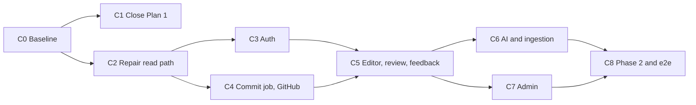

# Plan 5: Completing Plans 1 and 2

An audit of `00-overview.md`, `01-okf-vault-toolkit.md`, and `02-library.md` against the repository on 2026-09-27, followed by the work needed to finish them. Milestones here are prefixed `C` and slot in before Plans 3 and 4.

| Item | Value |
|---|---|
| Audited against | Working tree of `portable` (no commits yet) and `/Users/polaris/projects/mmdc/mmdc-vault` |
| Checks run | `pnpm turbo run typecheck test` (18 tasks pass, 229 tests), `pnpm lint` (clean), `pnpm format:check` (fails on 12 files), `kb lint` and `kb index --check` on the MMDC vault (0 errors, 21 warnings, indexes current) |
| Not verifiable locally | Anything "green in CI": the repository has no remote and no commits, so no workflow has ever run |

---

## 1. Audit summary

| Plan | Built and verified | Built with defects or deviations | Not built |
|---|---|---|---|
| Overview conventions | Layout, fixtures `vault-acme`, `vault-dirty`, `principals.yaml`, synthetic generator, leak canaries | Test tiers, Testcontainers, ports placement, demo scripts, decision numbering | `fixtures/uploads/`, `fixtures/patches/`, Playwright, axe, k6 |
| Plan 1 | M0 to M6 code and tests | M3 spike, M7 publishing and live workflow, M8 content and agent check, TSDoc and stability marking | Nothing of substance |
| Plan 2 | L0, L3, L4, L5 read path | L0 schema, L1, L2, L4 and L5 acceptance tests, several architecture rules | L6, L7, L8, L9, L10, section 5 e2e suite |

---

## 2. Plan 1 findings

| Milestone | Status | Evidence | Gap |
|---|---|---|---|
| M0 Skeleton | Done with gaps | Workspaces, Turborepo, ESLint, Vitest projects, `ci.yml` | CI has never run. `format:check` fails on 12 files and CI does not run it. No TypeScript project references (each package type-checks alone; acceptable, but the plan text says otherwise) |
| M1 Note model | Done | `roundtrip.test.ts`, `lifecycle.test.ts` | None |
| M2 Lint | Done | 24 rules, one `vault-dirty` case per rule, overlay duplicate-id test | Two rules beyond the plan (`lore/link-style`, `lore/provenance`) are not in the plan's table. The 30-second target is only checked in the nightly bench, which has never run in CI |
| M3 Links and graph | Done except the spike | `indexes.test.ts` | `docs/decisions/0001-link-style.md` is still Proposed with an empty results table. The default `link_style` is therefore unconfirmed, and GitHub's web view resolving `/` links from the repository root is an open argument for `relative` |
| M4 Operations | Done | `ops.test.ts` and snapshots | None |
| M5 Chunker | Done | 10 golden notes plus property tests | None |
| M6 CLI | Done with a documented deviation | 19 CLI tests, bundled binary test | `kb query` uses a custom index, not MiniSearch (`docs/decisions/0002-kb-query-index.md`). Plan 1 and TECH_STACK 5 still say MiniSearch |
| M7 Template and CI | Partly done | `templates/vault`, `create-vault.mjs`, `vault-template` CI job, `publish-cli.yml` | CLI not published. `kb.yml` never exercised on GitHub (lint failure, single regenerate commit, no loop). `npx -y @org/kb@1 lint` unproven |
| M8 Seed content and agent check | Partly done | MMDC vault: 286 markdown files, lints clean | Agent navigation check not run. Every note is unverified, every namespace is owned by the placeholder team `mmdc-tech`, and the vault has no commits, so "passes lint in CI on main" is unmet. Content is imported, not written with people |
| Definition of done | Not met | | 84 exported declarations in `packages/okf/src` lack a doc comment; nothing is marked stable; there is no changelog for the frozen API |

---

## 3. Plan 2 findings

### 3.1 Milestone status

| Milestone | Status | Gap |
|---|---|---|
| L0 Scaffolding | Partly done | Schema has 15 tables. Missing from TECH_STACK 7: Better Auth tables, `changesets`, `ingest_items`, `reviews`, `feedback`, `follows`, `notifications`, `llm_usage`. No additive-only migration check in CI. No MinIO in the compose file. `packages/ui` is empty; components live in `apps/web/src/components`. No container images |
| L1 Auth | Partly done | Dev login only. No Better Auth, Google, Entra, magic link, or organization. `audit_log` is written for dev sign-in only. "Grant changes take effect on the next request" and "outside domain cannot create an account" have unit coverage for the helper but no sign-up path to test |
| L2 Git | Partly done | `LocalGitProvider` and mirror reads exist. No commit job, no `GitHubProvider`, no webhook verification, no pull-request mode, no concurrent-commit test, no spike record |
| L3 Indexer | Done with one defect | See 3.2, staleness |
| L4 Search | Done with gaps | Leak canary does not cover the Cmd-K HTTP endpoint (`/api/search`). No k6 test |
| L5 Browse | Mostly done | No history diff view. Home shows themes, not pinned hubs. No Playwright, axe, or 375 px check in code. Assets are streamed from disk, not redirected to a signed URL |
| L6 to L10 | Not started | Editor, changesets, review, feedback, AI core, ingestion, Admin, phase 2 |
| Section 5 e2e suite | Not started | No Playwright dependency or config |

### 3.2 Defects in what was built

| # | Defect | Where | Effect |
|---|---|---|---|
| D1 | Staleness is frozen at index time. `stale` in the Meilisearch document and the stale penalty in `health_score` are computed from `now` during indexing, and the job skips when the head has not moved | `apps/worker/src/indexer/derive.ts` (`healthScore`, `noteDoc`), `index-vault.ts` (early return) | A note that passes its `stale_after` date keeps `stale: false` in search facets and keeps its old health score until some commit lands. A rebuild on a later day also differs from the incremental state, which the incremental-equals-full test hides by fixing the clock |
| D2 | The web app reads the file system | `apps/web/src/app/assets/[...path]/route.ts` | Breaks the rule in Plan 2 section 3 and will not work once web and worker are separate containers |
| D3 | The worker health endpoint binds to `127.0.0.1` | `apps/worker/src/main.ts` | Unreachable from outside its container, so uptime checks and compose health checks fail |
| D4 | Ports are in the wrong packages | `ObjectStore` is in `apps/worker/src/objects.ts` | The overview places `ObjectStore` in `@lore/ingest`. The web app cannot share it, which led to D2 |
| D5 | `EMBEDDINGS` accepts `hash`, `off`, `fail` | `apps/worker/src/config.ts`, `apps/web/src/lib/env.ts` | The plan's `local` (transformers.js) and `provider` modes do not exist. `AI_MODE` is parsed and never used |
| D6 | No route inventory | `apps/web/test/` | The plan's main guard against permission leaks (a new route without a read filter fails CI) does not exist |
| D7 | Integration tests skip when services are down | `apps/worker/test/harness.ts` | A local run can report green without running the indexer or canary tests. Testcontainers was the plan's answer |
| D8 | The indexer derives every note on every run | `index-vault.ts` | Correct, but the 30-second freshness target is unproven at 20,000 notes |

### 3.3 Documents that no longer match the code

| Document | Says | Actual |
|---|---|---|
| Plan 1 M6, TECH_STACK 5 | `kb query` uses MiniSearch | Custom binary index |
| Plan 2 L2, L8 | Decision records `0002-commit-api.md`, `0003-pdf-extraction.md` | `0002` is taken by the query index record |
| Plan 2 section 2 | `postgres:16`, MinIO, default ports | `postgres:18.6`, no MinIO, ports 5433 and 7701 |
| Overview section 5 | Testcontainers; `test`, `test:int`, `e2e` tiers | Compose services; one `test` tier |
| Overview section 5 | A demo script per milestone | `docs/demos/` has Plan 1 only |
| Plan 1 M2 | 22 rule ids | 24 |

---

## 4. Completion milestones

Sizes: S is 1 to 3 days, M is 3 to 6 days, L is 1 to 2 weeks. "Needs" lists what a person must supply before the milestone can close.

### C0. Baseline and first commit (S)

Build:

- Run `pnpm format` and add `pnpm format:check` to the `test` job in `ci.yml`.
- Create the GitHub repository, make the first commit, and push. Fix whatever the first CI run surfaces.
- Reconcile the documents in 3.3: update Plan 1 M6 and TECH_STACK 5 for the query index; renumber the pending decision records to `0003-commit-api.md` and `0004-pdf-extraction.md` in Plan 2; record Postgres 18, the ports, and the 24 rules.
- Decide the test tier question and record it in `docs/decisions/0005-test-tiers.md`. Recommended: keep compose services for local runs, add Testcontainers behind `test:int` so a run with no services fails instead of skipping (fixes D7), and add `test:int` and `e2e` scripts to `turbo.json`.
- Write `docs/demos/library-L0.md`, `L3`, `L4`, and `L5` from the commands already in `docs/plan-02-summary.md`.

Tests and acceptance:

- `ci.yml` is green on main, including `vault-template`, and the nightly `bench` job has run once and met all three targets on a CI runner.
- `pnpm test:int` with Docker stopped fails with a clear message.

Needs: a GitHub organization and repository; your go-ahead to commit.

### C1. Close Plan 1 (M)

Build:

- Obsidian spike: fill in the table in `0001-link-style.md` on macOS and Windows, set the status to Accepted, and if the result is `relative`, convert the template, `vault-acme`, and the MMDC vault with `kb lint --fix` and `kb index`, then regenerate goldens.
- Publish the CLI with `publish-cli.yml`. Replace `@yourorg/kb` in `ci.yml` with the real package name.
- Commit and push the MMDC vault. Stop re-running `scripts/import/mmdc-runbook.ts` from this point, because it rewrites `kb/`.
- Live workflow test as a nightly `@live` job on a scratch repository: a push with a lint error fails; a clean push produces exactly one `kb: regenerate indexes [skip ci]` commit.
- Run the three tasks in `docs/demos/agent-navigation.md` with a fresh agent session and fill in the table. If a task fails, tighten `AGENTS.md` and the kb-writer skill, add the pre-commit hook from the risk table, and re-run.
- M8 content: replace the `mmdc-tech` placeholder with real owner teams, and have owners run `kb verify` on the runbooks they stand behind. Target: at least 30 human-verified notes.
- API stability: add doc comments to the 84 undocumented exports in `packages/okf/src`, add `packages/okf/CHANGELOG.md`, and add an API snapshot test (exported names and signatures) so a change to the section 3 surface fails CI unless the changelog changes too.

Tests and acceptance:

- `npx -y @<org>/kb@1 lint` works on a machine with only Node.js 24 and a token.
- The MMDC vault's `kb` workflow is green on main.
- All three agent tasks pass, with the transcript linked from the demo document.
- Plan 1 section 6 is met line by line.

Needs: a person with Obsidian on macOS and on Windows; a token with package write access; real team names and owners for MMDC.

### C2. Repair the read path (M)

Build:

- D1: add a daily `refresh-stale` worker job that recomputes `stale`, `health_score`, and the Meilisearch documents for notes whose `stale_after` fell inside the last interval. Move `stale` out of the row hash so that the index job stays clock-independent.
- D2, D4: move `ObjectStore` to `@lore/ingest` with `FsObjectStore` and an S3 implementation, add MinIO to the compose file, and make the asset route check the namespace and then redirect to a short-lived signed URL.
- D3: bind the health endpoint to `0.0.0.0` behind a `WORKER_HOST` setting.
- D5: add `local` (transformers.js) to `EMBEDDINGS`. `provider` arrives with C6.
- D6: add the route inventory test. It enumerates every `page.tsx` and `route.ts` under `apps/web/src/app`, and fails unless each one is either on a short public allow-list or calls `requireContext` or `apiContext`. Extend the canary test to call `/api/search` over HTTP as each principal.
- D8: measure index time on the synthetic vault. If a one-note push exceeds 30 seconds, restrict parsing to the diff plus notes that link to changed paths, keeping the incremental-equals-full test as the guard.
- L0 gaps: the additive-only migration check in CI (fail on `DROP`, `RENAME`, or a new `NOT NULL` column without a default), and Dockerfiles for `apps/web` and `apps/worker`.
- L5 gaps: a worker mirror API (`GET /vaults/:id/diff?path=&from=&to=`, reachable only from the web container) and the history diff view; pinned hubs on Home, stored in `settings` per team.
- Fixtures: `fixtures/patches/obsidian-edit.patch` so the command in Plan 2 section 2 works as written.
- Move shared primitives (`Banner`, `Chip`, `TrustBadge`, `EmptyState`, `Section`, `PanelSection`) into `packages/ui` before the editor and Desk need them.

Tests and acceptance:

- With a `FakeClock` advanced past a note's `stale_after` and no new commit, the note shows `stale: true` in search and a lower health score after the job runs.
- The incremental-equals-full test passes with the rebuild running one day later than the incremental runs.
- The web container runs with no volume mounted and still serves images.
- Adding a route without a context call fails CI.
- Playwright and axe for the L5 acceptance list, and the k6 search test at p95 under 300 ms on the synthetic vault.

Needs: nothing external.

### C3. Finish L1: real sign-in (M)

Build as written in Plan 2 L1, with these specifics:

- Better Auth takes over `users`, `teams`, and `team_members` through an additive migration. `computeAccess`, `readableNamespaces`, and `requireNamespace` keep their signatures, so the existing permission tests must pass unchanged.
- Dev login stays, implemented as a Better Auth session so there is one session format.
- `audit_log` writes for sign-ins, grant changes, and exports. Commits and approvals are added in C4 and C5.

Tests and acceptance: Plan 2 L1, plus the existing dev-login-in-production refusal.

Needs: a test Google Workspace and a test Entra tenant.

### C4. Finish L2: commit job and GitHub (M)

Build as written in Plan 2 L2. The commit job does not depend on GitHub, so build and test it against `LocalGitProvider` first, then add `GitHubProvider` and run the same contract suite in the nightly `@live` job. Record the spike in `docs/decisions/0003-commit-api.md`.

Tests and acceptance: Plan 2 L2, including the two-concurrent-commits test that does not exist yet.

Needs: a scratch GitHub repository and a test GitHub App installation.

### C5. L6 and L7: changesets, editor, review, feedback (L + M)

Build as written. Prerequisites from this plan: C2 (`packages/ui`, mirror API for the merge view), C3 (real principals for credit and approval), and C4 (commit job). Add the `changesets`, `reviews`, `feedback`, and `notifications` tables here as additive migrations.

One addition: the health score formula in L7 depends on staleness, so it must go through the `refresh-stale` job from C2 rather than being recomputed only on index and feedback.

### C6. L8: AI core and ingestion (L)

Build as written. Add `ingest_items` and `llm_usage`. Create `fixtures/uploads/` (owned by Plan 1's fixture rules, so it is a reviewed change) with the files listed in the overview, including the DOCX with the prompt-injection payload. Record the PDF spike in `docs/decisions/0004-pdf-extraction.md`.

Needs: AI provider keys for the `@live` job; 10 real SOPs as PDFs for the spike.

### C7. L9: Admin (M)

Build as written. The route inventory test from C2 gains a second assertion: every route under `/admin` calls the admin guard.

### C8. L10 and the standalone suite (L)

Build L10 as written, with `follows` added as a migration. Then complete the 12-scenario suite in Plan 2 section 5 and wire `pnpm --filter web e2e` into pull request CI.

---

## 5. Order and dependencies

- C1 and C2 run in parallel. C1 is mostly waiting on people; C2 needs nobody.
- Plan 3 can start after C0 and C1, as the overview says. It does not need C2 onward.
- Plan 4 Stage A needs C0 to C7.

| Waiting on a person | Milestone |
|---|---|
| GitHub organization, repository, package token | C0, C1 |
| Obsidian on macOS and Windows | C1 |
| MMDC team names, owners, and a principals file | C1, C3 |
| Test Google Workspace and Entra tenants | C3 |
| Test GitHub App installation | C4 |
| AI keys and sample SOPs | C6 |

---

## 6. Definition of done

- Every row in sections 2 and 3 of this plan is closed or has a decision record explaining the deviation.
- Plan 1 section 6 and Plan 2 section 6 are met as written.
- The plans, TECH_STACK, and README describe the code as it is.
- CI on main is green for `test`, `test:int`, `e2e`, `vault-template`, and the nightly `bench` and `@live` jobs.

## 7. Risks

| Risk | Mitigation |
|---|---|
| The Obsidian spike picks `relative` after content exists | The conversion is already one command and is tested on `vault-acme`; do C1 before people edit the MMDC vault |
| Better Auth's tables conflict with the existing `users` and `teams` rows | Additive migration with a backfill; the permission tests pin the helper behaviour |
| The narrower indexer pass in C2 reintroduces drift | The incremental-equals-full test runs on every pull request, now with a moving clock |
| First CI run fails in ways local runs hide (ports, service start-up, turbo cache) | C0 exists to find this before more work piles on |
| Imported MMDC notes stay unverified indefinitely | C1 sets a target of 30 verified notes and names owners |
